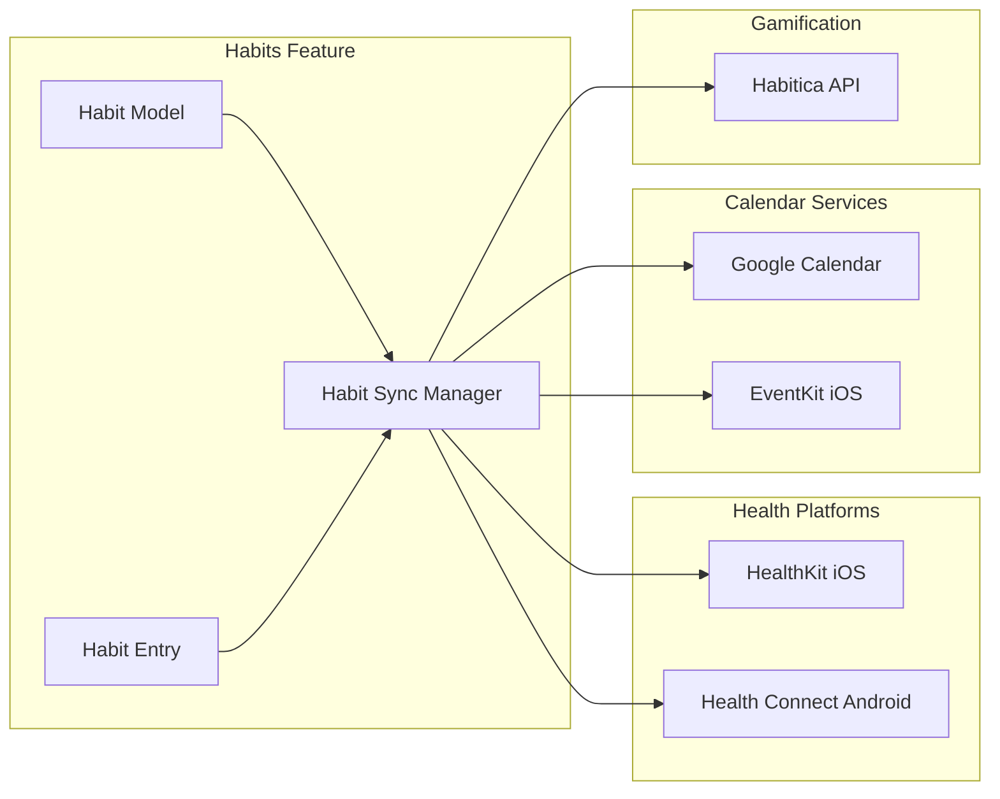
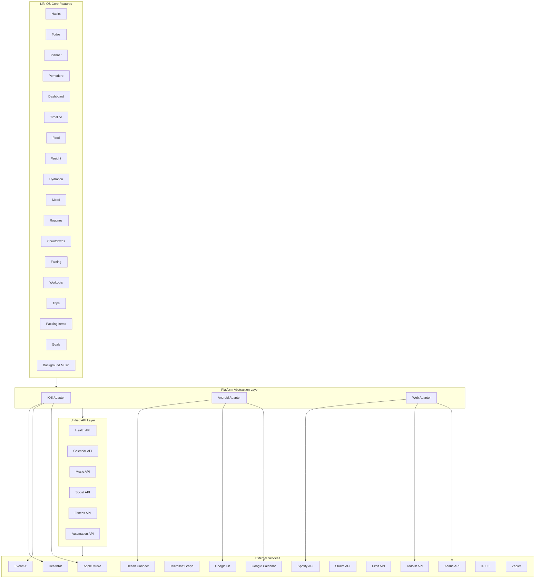
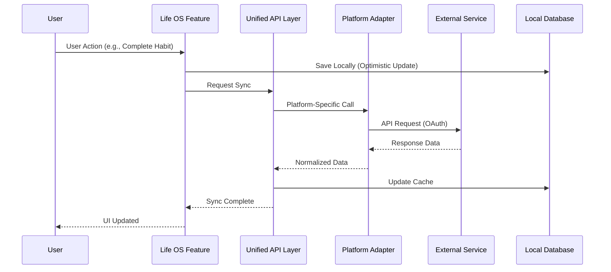
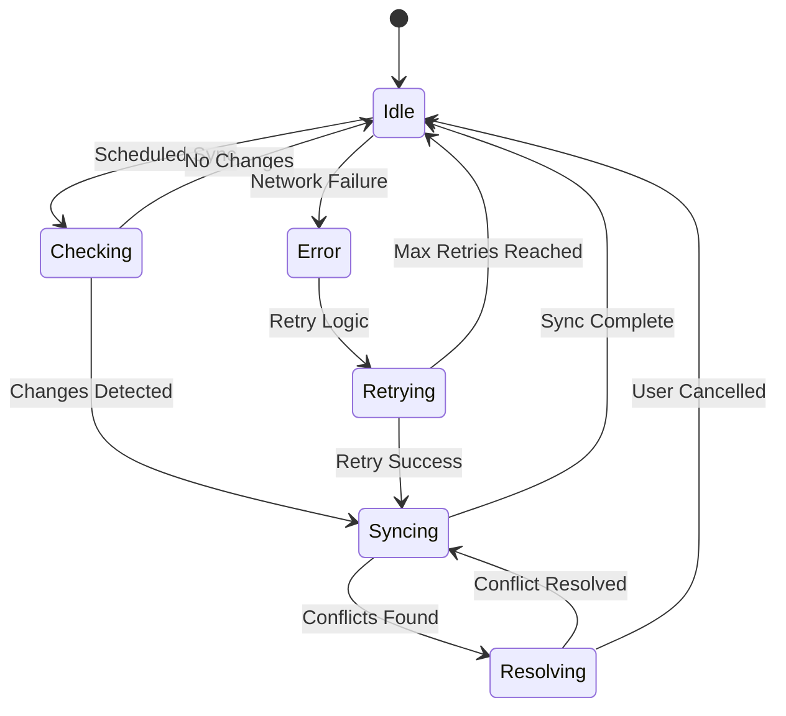
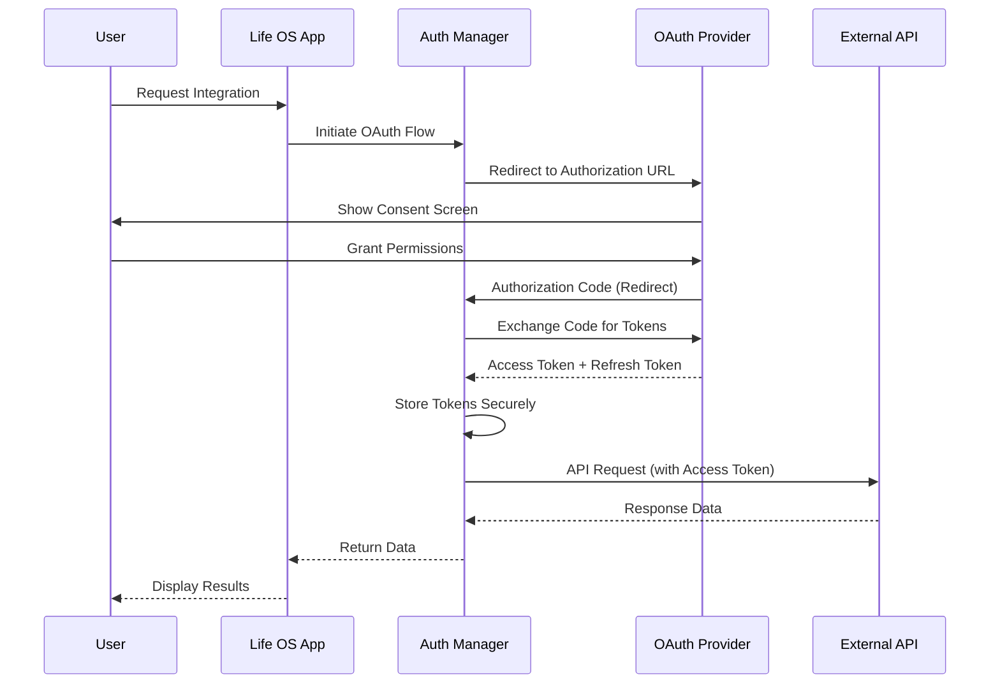
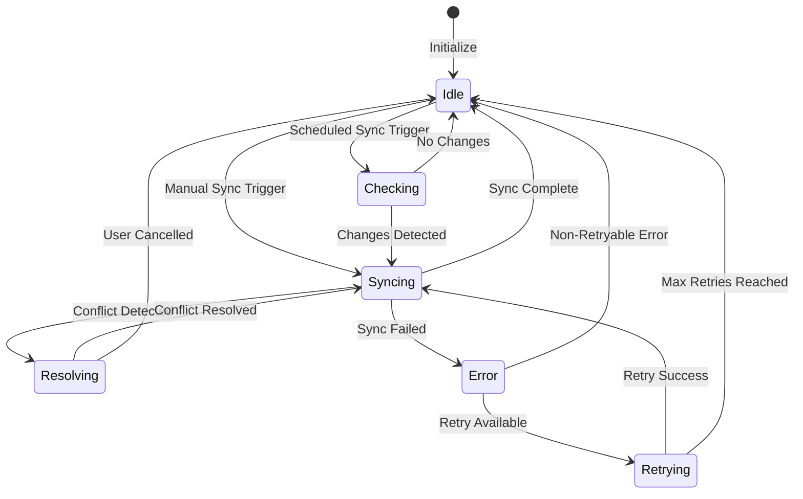

# Life OS - Cross-Platform Integrations Overview

## Objective

Provide a comprehensive view of **all 18 Life OS features**, the **existing apps/services users already use**, and the **integration points/API availability** for cross-platform (iOS & Android) deployment.

---

## Integration Table

| Feature | Existing Apps / Services | Integration Available | Notes / Limitations |
|---------|-------------------------|----------------------|---------------------|
| **Habits** | Apple Health, Google Fit, Calendar, Streaks, Habitica | HealthKit (iOS), Health Connect / Fit (Android), Google Calendar API, EventKit, Habitica API (read-only) | Core habit tracking via local APIs; aggregate streaks in backend; Habitica allows read-only sync |
| **Todos** | Google Calendar, Outlook, Apple Calendar, Todoist, Asana, Trello, Notion | Google Calendar API, Outlook Calendar API, EventKit, Todoist API, Asana API, Trello API, Notion API | Sync tasks/events; internal CRUD for advanced todo features; multiple task management platforms supported |
| **Planner** | Google Calendar, Outlook, Apple Calendar, Fantastical, Calendly | Google Calendar API, Outlook Calendar API, EventKit, Calendly API (read-only) | Time axis for Life OS; schedules and recurring events; two-way sync for major calendar providers |
| **Pomodoro** | System Focus Mode, iOS Notifications, Android AlarmManager, Forest, Be Focused | Local timers, notifications, Do Not Disturb integration, Forest API (limited) | No external app API required; native implementation recommended; Forest integration limited to read-only stats |
| **Dashboard** | Spotify, Apple Health, Google Fit, Apple Music, YouTube Music | Spotify Web API, Apple Music API (iOS only), HealthKit, Health Connect / Fit, YouTube Music API (limited) | Aggregated insights from health, activity, and music preference data; cross-platform music limited to Spotify |
| **Timeline** | Calendar, Health apps, Maps, Instagram, Twitter (X) | Google Calendar API, EventKit, HealthKit, Health Connect / Fit, Google Maps / Mapbox, Instagram Basic Display API, Twitter API v2 | Unified timeline from events, workouts, trips, and mood context; social media integration optional |
| **Food** | Nutritionix, Edamam, Open Food Facts, MyFitnessPal, Lose It!, Cronometer | REST APIs for nutrition lookup (Nutritionix, Edamam, Open Food Facts), MyFitnessPal API (limited, requires partnership), Lose It! API (read-only), Cronometer API | No direct sync with MyFitnessPal without partnership; internal logging for personal food entries; nutrition database APIs available |
| **Weight** | Apple Health, Google Fit, Fitbit, Withings, Garmin, Samsung Health | HealthKit, Health Connect / Fit, Fitbit API, Withings API, Garmin API (requires partner access), Samsung Health API | Track weight changes, integrate across devices; sensitive data stored as aggregated insights; multiple device support |
| **Hydration** | Apple Health, HidrateSpark, WaterMinder, Hydro Coach | HealthKit, optional HidrateSpark partner API, WaterMinder API (limited) | Track water intake; some devices may require manual entry or device sync; smart bottle integration possible |
| **Mood** | Spotify (emotional context), Apple Health (Mindful minutes), Daylio, Mood Meter | Spotify Web API, HealthKit, Daylio API (read-only, limited), Mood Meter API (none) | AI insights recommended; limited direct app data available; Daylio sync requires user export |
| **Routines** | Apple Shortcuts, Google Assistant, IFTTT, Zapier, Home Assistant | Shortcuts Intents (iOS), Android Intents / Google Assistant, Webhooks (IFTTT, Zapier), Home Assistant API | Platform-specific automation; manage routines and triggers; extensive automation platform support |
| **Countdowns** | System clock, Reminders, Google Calendar, Apple Calendar | Native timers, notifications, Google Calendar API, EventKit | No external app integration required; supports Pomodoro and custom countdowns; calendar integration for event countdowns |
| **Fasting** | Apple Health, Google Fit, Zero, Fastic, Life Fasting Tracker | HealthKit, Health Connect / Fit, Zero API (none), Fastic API (none), Life Fasting Tracker API (limited) | Track fasting windows; cannot sync closed apps like Zero / Fastic directly; manual entry or Health app sync |
| **Workouts** | Apple Fitness, Strava, Fitbit, Garmin, Nike Run Club, Peloton, MyFitnessPal | HealthKit, Health Connect / Fit, Strava API, Fitbit API, Garmin API (requires partner access), Nike Run Club API (limited), Peloton API (read-only), MyFitnessPal API (limited) | Aggregate activity data; Garmin may require partner access; extensive fitness platform support |
| **Trips** | Google Maps, TripIt, Weather services, Airbnb, Booking.com, Expedia | Google Maps API, Mapbox, OpenWeather API, TripIt API (read-only), Airbnb API (none), Booking.com API (none), Expedia API (limited) | Planning, timeline, and context-aware recommendations; booking platforms have limited/no API access |
| **Packing Items** | PackPoint, Notes apps, Weather, TripIt | Internal checklist API, Weather API, PackPoint API (none), TripIt API (read-only) | Smart suggestions based on trip location and weather; no direct PackPoint API sync; weather-based recommendations |
| **Goals** | Apple Health, Fitbit, Strava, MyFitnessPal, Habitica | HealthKit, Health Connect / Fit, Strava API, Fitbit API, MyFitnessPal API (limited), Habitica API (read-only) | Goal tracking for fitness, habits, and routines; aggregation across platforms; Habitica allows read-only sync |
| **Background Music & Ambient Sounds** | Spotify, Apple Music, YouTube Music, Calm, Headspace, Noisli | Spotify Web API, Apple Music API (iOS only), YouTube Music API (limited), Calm API (none), Headspace API (none), Noisli API (none) | Music streaming APIs available; meditation apps have closed APIs; ambient sounds must be self-hosted or use royalty-free sources |

---

## Integration Principles

1. **Device-first, cloud-unified**: Sensitive data remains local; backend stores **aggregated insights** only.
2. **Cross-platform adapters**: Implement **platform-specific APIs** under a unified abstraction layer.
3. **User consent**: Explicit permission for each integration; users can revoke anytime.
4. **Internal core**: All features work standalone; integrations **enhance**, not block core functionality.
5. **Analytics & AI layer**: Provides insights without storing raw personal data from sensitive sources.
6. **Privacy by design**: Health data never leaves device without explicit consent; only aggregated metrics synced.
7. **Graceful degradation**: Features work offline; integrations are optional enhancements.

---

## Recommended Cross-Platform Tech Stack

### Frontend
- **Framework**: React Native / Flutter
- **State Management**: Redux / Zustand / Provider
- **UI Components**: React Native Paper / Flutter Material

### Backend
- **Runtime**: Node.js / Python
- **API**: REST / GraphQL
- **Database**: PostgreSQL / MongoDB (for aggregated data only)
- **Caching**: Redis

### Health Integration
- **iOS**: HealthKit framework
- **Android**: Health Connect API / Google Fit API
- **Abstraction Layer**: Unified health data adapter

### Music Integration
- **Cross-platform**: Spotify Web API (OAuth 2.0)
- **iOS**: Apple Music API (native)
- **Android**: YouTube Music API (limited)
- **Local**: Self-hosted ambient sound files

### Calendar Integration
- **Google Calendar**: Google Calendar API
- **Outlook**: Microsoft Graph API
- **Apple Calendar**: EventKit (iOS) / CalDAV (cross-platform)
- **Unified Adapter**: Calendar sync abstraction layer

### Maps & Trips
- **Maps**: Google Maps SDK / Mapbox SDK
- **Weather**: OpenWeather API / WeatherAPI
- **Geocoding**: Google Geocoding API / Mapbox Geocoding API

### Notifications & Focus
- **iOS**: UserNotifications, UNNotificationCenter, Focus modes
- **Android**: NotificationManager, Do Not Disturb API
- **Cross-platform**: React Native Push Notifications / Firebase Cloud Messaging

### Analytics & Insights
- **Analytics**: Firebase Analytics / Amplitude / Mixpanel
- **AI/ML**: OpenAI API / Anthropic Claude / Local ML models
- **Storage**: Aggregated metrics only, no raw personal data

### Data Storage
- **Local**: IndexedDB (web) / SQLite (mobile) / Realm (mobile)
- **Sync**: Custom sync protocol or Firebase Realtime Database
- **Backup**: iCloud / Google Drive (encrypted)

---

## Feature-Specific Integration Details

### 1. Habits Integration

#### Overview

The Habits feature integrates with health platforms (HealthKit, Health Connect), calendar services (Google Calendar), and gamification platforms (Habitica) to enhance habit tracking with external data sources and automated scheduling.

**Integration Benefits:**
- **Health Apps**: Sync exercise and meditation habits as health activities
- **Calendar**: Automatically create recurring events for scheduled habits
- **Gamification**: Import progress from Habitica for motivation

**Use Cases:**
- Track exercise habits in Apple Health/Google Fit
- Create calendar reminders for time-based habits
- View Habitica progress alongside Life OS habits
- Aggregate habit data across platforms

#### Integration Architecture



#### HealthKit Integration (iOS)

**Purpose**: Sync health-related habit completions (exercise, meditation) to Apple Health.

**Required Permissions:**
- `HKQuantityTypeIdentifierAppleExerciseTime` - Exercise time
- `HKCategoryTypeIdentifierMindfulSession` - Meditation sessions
- `HKQuantityTypeIdentifierStepCount` - Step count (for walking habits)

**Implementation:**

```typescript
class HealthKitHabitsAdapter {
  private healthStore: HKHealthStore;
  
  async syncHabitCompletion(habit: Habit, entry: HabitEntry): Promise<void> {
    if (!entry.completed) return;
    
    // Map habit to HealthKit data type
    const hkType = this.mapHabitToHealthKitType(habit);
    if (!hkType) return; // Not a health-related habit
    
    // Create HealthKit sample
    const sample = this.createHealthKitSample(hkType, entry);
    
    // Save to HealthKit
    try {
      await this.healthStore.saveObject(sample);
    } catch (error) {
      throw new HealthKitError('Failed to save habit to HealthKit', error);
    }
  }
  
  private mapHabitToHealthKitType(habit: Habit): HKObjectType | null {
    const category = habit.category.toLowerCase();
    const name = habit.name.toLowerCase();
    
    // Exercise habits
    if (category === 'work' && (name.includes('exercise') || name.includes('workout'))) {
      return HKQuantityType.quantityTypeForIdentifier(HKQuantityTypeIdentifierAppleExerciseTime);
    }
    
    // Meditation habits
    if (name.includes('meditation') || name.includes('mindful')) {
      return HKCategoryType.categoryTypeForIdentifier(HKCategoryTypeIdentifierMindfulSession);
    }
    
    // Walking habits
    if (name.includes('walk') || name.includes('steps')) {
      return HKQuantityType.quantityTypeForIdentifier(HKQuantityTypeIdentifierStepCount);
    }
    
    return null;
  }
  
  private createHealthKitSample(type: HKObjectType, entry: HabitEntry): HKSample {
    const date = entry.date;
    
    if (type instanceof HKQuantityType) {
      const quantity = HKQuantity.quantityWithUnit(
        HKUnit.minute(),
        entry.count || 1
      );
      
      return HKQuantitySample.sampleWithType(
        type,
        quantity,
        date,
        date,
        {
          HKMetadataKeyWorkoutActivityType: HKWorkoutActivityTypeTraditionalStrengthTraining
        }
      );
    } else if (type instanceof HKCategoryType) {
      return HKCategorySample.sampleWithType(
        type,
        HKCategoryValue.notApplicable,
        date,
        date
      );
    }
    
    throw new Error('Unsupported HealthKit type');
  }
  
  async readHealthDataForHabit(
    habit: Habit,
    startDate: Date,
    endDate: Date
  ): Promise<HealthData[]> {
    const hkType = this.mapHabitToHealthKitType(habit);
    if (!hkType) return [];
    
    const predicate = HKQuery.predicateForSamplesWithStartDateEndDateOptions(
      startDate,
      endDate,
      HKQueryOptions.strictStartDate
    );
    
    return new Promise((resolve, reject) => {
      const query = new HKSampleQuery(
        hkType,
        predicate,
        null,
        null,
        (query, results, error) => {
          if (error) {
            reject(new HealthKitError('Failed to read HealthKit data', error));
            return;
          }
          
          const healthData = (results || []).map(sample => ({
            date: sample.startDate,
            value: this.extractValue(sample),
            source: 'HealthKit'
          }));
          
          resolve(healthData);
        }
      );
      
      this.healthStore.executeQuery(query);
    });
  }
  
  private extractValue(sample: HKSample): number {
    if (sample instanceof HKQuantitySample) {
      return sample.quantity.doubleValueForUnit(HKUnit.minute());
    }
    return 1; // Category samples are binary
  }
}
```

**Error Handling:**

```typescript
class HealthKitError extends Error {
  constructor(
    message: string,
    public originalError: NSError
  ) {
    super(message);
    this.name = 'HealthKitError';
  }
  
  static fromNSError(error: NSError): HealthKitError {
    const messages: Record<number, string> = {
      1: 'Health data unavailable',
      2: 'Health data restricted',
      3: 'Invalid argument',
      4: 'Authorization denied',
      5: 'Authorization not determined'
    };
    
    return new HealthKitError(
      messages[error.code] || 'Unknown HealthKit error',
      error
    );
  }
}
```

#### Health Connect Integration (Android)

**Purpose**: Sync health-related habit completions to Android Health Connect.

**Required Permissions:**
- `androidx.health.permission.ExerciseSessionRecord.READ_WRITE`
- `androidx.health.permission.MindfulnessSessionRecord.READ_WRITE`
- `androidx.health.permission.StepsRecord.READ_WRITE`

**Implementation:**

```typescript
class HealthConnectHabitsAdapter {
  private healthConnectClient: HealthConnectClient;
  
  async syncHabitCompletion(habit: Habit, entry: HabitEntry): Promise<void> {
    if (!entry.completed) return;
    
    const recordType = this.mapHabitToHealthConnectType(habit);
    if (!recordType) return;
    
    const record = this.createHealthConnectRecord(recordType, entry);
    
    try {
      await this.healthConnectClient.insertRecords([record]);
    } catch (error) {
      if (error instanceof HealthConnectException) {
        throw this.handleHealthConnectError(error);
      }
      throw error;
    }
  }
  
  private mapHabitToHealthConnectType(habit: Habit): RecordType | null {
    const category = habit.category.toLowerCase();
    const name = habit.name.toLowerCase();
    
    if (category === 'work' && (name.includes('exercise') || name.includes('workout'))) {
      return ExerciseSessionRecord;
    }
    
    if (name.includes('meditation') || name.includes('mindful')) {
      return MindfulnessSessionRecord;
    }
    
    if (name.includes('walk') || name.includes('steps')) {
      return StepsRecord;
    }
    
    return null;
  }
  
  private createHealthConnectRecord(
    recordType: RecordType,
    entry: HabitEntry
  ): Record {
    const startTime = entry.date;
    const endTime = new Date(startTime.getTime() + (entry.count || 1) * 60 * 1000);
    
    if (recordType === ExerciseSessionRecord) {
      return new ExerciseSessionRecord({
        startTime: startTime,
        endTime: endTime,
        exerciseType: ExerciseType.WORKOUT,
        title: 'Habit Completion',
        notes: entry.notes
      });
    }
    
    if (recordType === MindfulnessSessionRecord) {
      return new MindfulnessSessionRecord({
        startTime: startTime,
        endTime: endTime,
        title: 'Meditation Habit'
      });
    }
    
    if (recordType === StepsRecord) {
      return new StepsRecord({
        startTime: startTime,
        endTime: endTime,
        count: entry.count || 1000
      });
    }
    
    throw new Error('Unsupported Health Connect record type');
  }
  
  async requestPermissions(types: HealthDataType[]): Promise<PermissionStatus> {
    const permissions = types.map(t => this.mapToHealthConnectPermission(t));
    
    try {
      const granted = await this.healthConnectClient.requestPermissions(
        new Set(permissions)
      );
      
      return {
        granted: granted.size === permissions.length,
        grantedPermissions: Array.from(granted)
      };
    } catch (error) {
      return {
        granted: false,
        error: error.message
      };
    }
  }
  
  private handleHealthConnectError(error: HealthConnectException): Error {
    const errorCodes: Record<number, string> = {
      1: 'Invalid argument',
      2: 'IO error',
      3: 'Security error',
      4: 'Unknown error',
      5: 'Rate limit exceeded'
    };
    
    return new Error(
      errorCodes[error.errorCode] || 'Health Connect error'
    );
  }
}
```

#### Google Calendar Integration

**Purpose**: Create recurring calendar events for scheduled habits.

**API Endpoints:**
- `POST /calendar/v3/calendars/{calendarId}/events` - Create event
- `PUT /calendar/v3/calendars/{calendarId}/events/{eventId}` - Update event
- `DELETE /calendar/v3/calendars/{calendarId}/events/{eventId}` - Delete event

**OAuth Scopes Required:**
- `https://www.googleapis.com/auth/calendar.events`

**Implementation:**

```typescript
class GoogleCalendarHabitsAdapter {
  private apiClient: AuthenticatedAPIClient;
  private calendarId: string = 'primary';
  
  async createHabitEvent(habit: Habit): Promise<CalendarEvent> {
    if (habit.schedule.type === 'daily') {
      return this.createDailyRecurringEvent(habit);
    } else if (habit.schedule.type === 'weekly') {
      return this.createWeeklyRecurringEvent(habit);
    }
    
    throw new Error('Unsupported habit schedule type');
  }
  
  private async createDailyRecurringEvent(habit: Habit): Promise<CalendarEvent> {
    const event: GoogleCalendarEvent = {
      summary: habit.name,
      description: habit.description || '',
      start: {
        dateTime: this.getHabitTime(habit).toISOString(),
        timeZone: Intl.DateTimeFormat().resolvedOptions().timeZone
      },
      end: {
        dateTime: new Date(
          this.getHabitTime(habit).getTime() + 30 * 60 * 1000
        ).toISOString(),
        timeZone: Intl.DateTimeFormat().resolvedOptions().timeZone
      },
      recurrence: ['RRULE:FREQ=DAILY'],
      reminders: {
        useDefault: false,
        overrides: [
          { method: 'popup', minutes: 15 }
        ]
      }
    };
    
    const response = await this.apiClient.request<GoogleCalendarEvent>(
      `/calendar/v3/calendars/${this.calendarId}/events`,
      {
        method: 'POST',
        body: JSON.stringify(event)
      }
    );
    
    return this.mapGoogleEventToInternal(response);
  }
  
  private async createWeeklyRecurringEvent(habit: Habit): Promise<CalendarEvent> {
    const daysOfWeek = habit.schedule.daysOfWeek || [];
    const byDay = daysOfWeek.map(day => ['SU', 'MO', 'TU', 'WE', 'TH', 'FR', 'SA'][day]);
    
    const event: GoogleCalendarEvent = {
      summary: habit.name,
      description: habit.description || '',
      start: {
        dateTime: this.getHabitTime(habit).toISOString(),
        timeZone: Intl.DateTimeFormat().resolvedOptions().timeZone
      },
      end: {
        dateTime: new Date(
          this.getHabitTime(habit).getTime() + 30 * 60 * 1000
        ).toISOString(),
        timeZone: Intl.DateTimeFormat().resolvedOptions().timeZone
      },
      recurrence: [`RRULE:FREQ=WEEKLY;BYDAY=${byDay.join(',')}`],
      reminders: {
        useDefault: false,
        overrides: [
          { method: 'popup', minutes: 15 }
        ]
      }
    };
    
    const response = await this.apiClient.request<GoogleCalendarEvent>(
      `/calendar/v3/calendars/${this.calendarId}/events`,
      {
        method: 'POST',
        body: JSON.stringify(event)
      }
    );
    
    return this.mapGoogleEventToInternal(response);
  }
  
  async updateHabitEvent(habit: Habit, eventId: string): Promise<CalendarEvent> {
    const event = await this.createHabitEvent(habit);
    
    const response = await this.apiClient.request<GoogleCalendarEvent>(
      `/calendar/v3/calendars/${this.calendarId}/events/${eventId}`,
      {
        method: 'PUT',
        body: JSON.stringify(event)
      }
    );
    
    return this.mapGoogleEventToInternal(response);
  }
  
  async deleteHabitEvent(eventId: string): Promise<void> {
    await this.apiClient.request(
      `/calendar/v3/calendars/${this.calendarId}/events/${eventId}`,
      {
        method: 'DELETE'
      }
    );
  }
  
  private getHabitTime(habit: Habit): Date {
    // Default to 9 AM if no time specified
    const time = habit.schedule.time || '09:00';
    const [hours, minutes] = time.split(':').map(Number);
    const date = new Date();
    date.setHours(hours, minutes, 0, 0);
    return date;
  }
  
  private mapGoogleEventToInternal(event: GoogleCalendarEvent): CalendarEvent {
    return {
      id: event.id,
      title: event.summary,
      description: event.description,
      startTime: new Date(event.start.dateTime),
      endTime: new Date(event.end.dateTime),
      allDay: !event.start.dateTime,
      recurrence: this.parseRecurrence(event.recurrence),
      externalId: event.id,
      externalSource: 'google_calendar'
    };
  }
  
  private parseRecurrence(rrules: string[]): RecurrenceRule | null {
    if (!rrules || rrules.length === 0) return null;
    
    const rrule = rrules[0];
    const match = rrule.match(/FREQ=(\w+)/);
    if (!match) return null;
    
    const frequency = match[1].toLowerCase();
    const byDayMatch = rrule.match(/BYDAY=([\w,]+)/);
    const daysOfWeek = byDayMatch 
      ? byDayMatch[1].split(',').map(day => {
          const dayMap: Record<string, number> = {
            'SU': 0, 'MO': 1, 'TU': 2, 'WE': 3, 'TH': 4, 'FR': 5, 'SA': 6
          };
          return dayMap[day];
        })
      : undefined;
    
    return {
      frequency: frequency as 'daily' | 'weekly' | 'monthly' | 'yearly',
      interval: 1,
      daysOfWeek
    };
  }
}

interface GoogleCalendarEvent {
  id?: string;
  summary: string;
  description?: string;
  start: { dateTime: string; timeZone: string };
  end: { dateTime: string; timeZone: string };
  recurrence?: string[];
  reminders?: {
    useDefault: boolean;
    overrides: Array<{ method: string; minutes: number }>;
  };
}
```

#### Habitica Integration (Read-Only)

**Purpose**: Import habit progress from Habitica for gamification data.

**API Endpoints:**
- `GET /api/v3/user` - Get user data (includes habits)
- `GET /api/v3/tasks/user` - Get all user tasks (habits, dailies, todos)

**Authentication:**
- API Key: User's Habitica API token
- User ID: User's Habitica UUID

**Limitations:**
- Read-only API (cannot write completions)
- Rate limit: 30 requests per minute
- Requires user's API token

**Implementation:**

```typescript
class HabiticaHabitsAdapter {
  private apiClient: APIClient;
  private userId: string;
  private apiToken: string;
  
  constructor(userId: string, apiToken: string) {
    this.userId = userId;
    this.apiToken = apiToken;
    this.apiClient = new APIClient('https://habitica.com/api/v3', {
      headers: {
        'x-api-user': userId,
        'x-api-key': apiToken
      }
    });
  }
  
  async getHabits(): Promise<HabiticaHabit[]> {
    try {
      const response = await this.apiClient.request<HabiticaTasksResponse>(
        '/tasks/user?type=habits'
      );
      
      return response.data.filter(task => task.type === 'habit');
    } catch (error) {
      if (error.status === 401) {
        throw new HabiticaAuthError('Invalid API credentials');
      }
      throw new HabiticaError('Failed to fetch habits', error);
    }
  }
  
  async syncHabiticaHabits(): Promise<SyncedHabit[]> {
    const habiticaHabits = await this.getHabits();
    
    return habiticaHabits.map(habit => ({
      id: `habitica_${habit.id}`,
      name: habit.text,
      description: habit.notes || '',
      externalId: habit.id,
      externalSource: 'habitica',
      streak: habit.streak || 0,
      score: this.calculateScore(habit),
      lastCompleted: habit.dateCompleted 
        ? new Date(habit.dateCompleted)
        : null
    }));
  }
  
  private calculateScore(habit: HabiticaHabit): 'A' | 'B' | 'C' | 'D' | 'F' {
    // Habitica uses frequency (how often completed)
    // Map to Life OS scoring system
    const frequency = habit.frequency || 'daily';
    const streak = habit.streak || 0;
    
    if (streak >= 30) return 'A';
    if (streak >= 20) return 'B';
    if (streak >= 10) return 'C';
    if (streak >= 5) return 'D';
    return 'F';
  }
}

interface HabiticaHabit {
  id: string;
  text: string;
  notes?: string;
  type: 'habit';
  frequency: 'daily' | 'weekly';
  streak?: number;
  dateCompleted?: string;
  value: number;
}

interface HabiticaTasksResponse {
  data: HabiticaHabit[];
}

class HabiticaError extends Error {
  constructor(message: string, public originalError: any) {
    super(message);
    this.name = 'HabiticaError';
  }
}

class HabiticaAuthError extends HabiticaError {
  constructor(message: string) {
    super(message, null);
    this.name = 'HabiticaAuthError';
  }
}
```

#### Unified Habits Integration Manager

```typescript
class HabitsIntegrationManager {
  private healthAdapter: IHealthAdapter;
  private calendarAdapter: ICalendarAdapter;
  private habiticaAdapter?: HabiticaHabitsAdapter;
  
  async syncHabitCompletion(habit: Habit, entry: HabitEntry): Promise<void> {
    const promises: Promise<void>[] = [];
    
    // Sync to health apps if health-related
    if (this.isHealthRelatedHabit(habit)) {
      promises.push(this.healthAdapter.syncHabitCompletion(habit, entry));
    }
    
    // Sync to calendar if scheduled
    if (habit.schedule.type !== 'manual') {
      // Calendar sync is handled separately via event creation
    }
    
    await Promise.allSettled(promises);
  }
  
  async setupCalendarIntegration(habit: Habit): Promise<CalendarEvent> {
    return this.calendarAdapter.createHabitEvent(habit);
  }
  
  async importHabiticaHabits(): Promise<SyncedHabit[]> {
    if (!this.habiticaAdapter) {
      throw new Error('Habitica not configured');
    }
    
    return this.habiticaAdapter.syncHabiticaHabits();
  }
  
  private isHealthRelatedHabit(habit: Habit): boolean {
    const name = habit.name.toLowerCase();
    const category = habit.category.toLowerCase();
    
    return (
      name.includes('exercise') ||
      name.includes('workout') ||
      name.includes('meditation') ||
      name.includes('mindful') ||
      name.includes('walk') ||
      name.includes('steps') ||
      category === 'work' && name.includes('fitness')
    );
  }
}
```

#### Error Handling

```typescript
class HabitsIntegrationError extends Error {
  constructor(
    message: string,
    public integration: 'healthkit' | 'health_connect' | 'google_calendar' | 'habitica',
    public originalError?: Error
  ) {
    super(message);
    this.name = 'HabitsIntegrationError';
  }
  
  static handle(error: Error, integration: string): HabitsIntegrationError {
    if (error instanceof HealthKitError) {
      return new HabitsIntegrationError(
        `HealthKit sync failed: ${error.message}`,
        'healthkit',
        error
      );
    }
    
    if (error instanceof HealthConnectException) {
      return new HabitsIntegrationError(
        `Health Connect sync failed: ${error.message}`,
        'health_connect',
        error
      );
    }
    
    if (error instanceof APIError) {
      return new HabitsIntegrationError(
        `Calendar sync failed: ${error.message}`,
        'google_calendar',
        error
      );
    }
    
    if (error instanceof HabiticaError) {
      return new HabitsIntegrationError(
        `Habitica sync failed: ${error.message}`,
        'habitica',
        error
      );
    }
    
    return new HabitsIntegrationError(
      `Unknown error in ${integration}`,
      integration as any,
      error
    );
  }
}
```

#### User Flows

**Setup Flow: Health Integration**
1. User creates a health-related habit (e.g., "Morning Exercise")
2. System detects it's health-related
3. User prompted: "Sync to Apple Health/Google Fit?"
4. User grants permissions
5. Habit completions automatically sync to health app

**Setup Flow: Calendar Integration**
1. User creates habit with schedule (e.g., "Daily Meditation at 8 AM")
2. System prompts: "Add to Google Calendar?"
3. User confirms
4. Recurring calendar event created
5. User receives calendar reminders

**Setup Flow: Habitica Integration**
1. User navigates to Settings > Integrations > Habitica
2. User enters Habitica User ID and API Token
3. System validates credentials
4. System imports habits from Habitica
5. Habitica habits appear in Life OS (read-only)

#### Rate Limits & Quotas

- **HealthKit**: No rate limits (local API)
- **Health Connect**: No rate limits (local API)
- **Google Calendar**: 1,000,000 queries per day per project
- **Habitica**: 30 requests per minute per user

#### Testing Scenarios

1. **Health Sync**: Complete exercise habit, verify HealthKit entry created
2. **Calendar Sync**: Create scheduled habit, verify calendar event created
3. **Habitica Import**: Import habits, verify data mapped correctly
4. **Permission Denial**: Deny health permissions, verify graceful degradation
5. **Network Failure**: Disable network, verify calendar sync queues
6. **Token Expiry**: Expire OAuth token, verify automatic refresh

---

### 2. Todos Integration

#### Overview

The Todos feature integrates with multiple task management and calendar platforms to enable two-way synchronization of tasks, enabling users to manage todos across their preferred platforms while maintaining a unified view in Life OS.

**Integration Benefits:**
- **Calendar Sync**: Tasks with due dates appear in calendar apps
- **Task Management**: Sync with popular task management platforms
- **Project Management**: Link todos to projects in Asana, Trello, Notion
- **Cross-Platform**: Access todos from any connected platform

**Use Cases:**
- Sync work todos to Outlook/Google Calendar
- Import todos from Todoist
- Link todos to Asana projects
- Organize todos in Notion databases

#### Google Calendar Integration

**API Endpoints:**
- `POST /calendar/v3/calendars/{calendarId}/events` - Create task event
- `PUT /calendar/v3/calendars/{calendarId}/events/{eventId}` - Update task
- `DELETE /calendar/v3/calendars/{calendarId}/events/{eventId}` - Delete task
- `GET /calendar/v3/calendars/{calendarId}/events` - List tasks

**OAuth Scopes:** `https://www.googleapis.com/auth/calendar.events`

**Implementation:**

```typescript
class GoogleCalendarTodosAdapter {
  private apiClient: AuthenticatedAPIClient;
  
  async syncTodo(todo: Todo): Promise<CalendarEvent> {
    if (!todo.dueDate) {
      throw new Error('Todo must have due date for calendar sync');
    }
    
    const event: GoogleCalendarEvent = {
      summary: todo.title,
      description: todo.description || '',
      start: {
        dateTime: todo.dueDate.toISOString(),
        timeZone: Intl.DateTimeFormat().resolvedOptions().timeZone
      },
      end: {
        dateTime: new Date(todo.dueDate.getTime() + 60 * 60 * 1000).toISOString(),
        timeZone: Intl.DateTimeFormat().resolvedOptions().timeZone
      },
      reminders: {
        useDefault: false,
        overrides: [
          { method: 'popup', minutes: todo.priority === 'high' ? 60 : 15 }
        ]
      },
      extendedProperties: {
        private: {
          'life_os_todo_id': todo.id,
          'life_os_completed': todo.completed.toString()
        }
      }
    };
    
    if (todo.externalId) {
      // Update existing event
      const response = await this.apiClient.request<GoogleCalendarEvent>(
        `/calendar/v3/calendars/primary/events/${todo.externalId}`,
        { method: 'PUT', body: JSON.stringify(event) }
      );
      return this.mapToCalendarEvent(response);
    } else {
      // Create new event
      const response = await this.apiClient.request<GoogleCalendarEvent>(
        '/calendar/v3/calendars/primary/events',
        { method: 'POST', body: JSON.stringify(event) }
      );
      return this.mapToCalendarEvent(response);
    }
  }
  
  async pullTodos(startDate: Date, endDate: Date): Promise<Todo[]> {
    const response = await this.apiClient.request<{ items: GoogleCalendarEvent[] }>(
      `/calendar/v3/calendars/primary/events?` +
      `timeMin=${startDate.toISOString()}&` +
      `timeMax=${endDate.toISOString()}&` +
      `singleEvents=true`
    );
    
    return response.items
      .filter(event => event.extendedProperties?.private?.['life_os_todo_id'])
      .map(event => this.mapToTodo(event));
  }
  
  private mapToTodo(event: GoogleCalendarEvent): Todo {
    return {
      id: event.extendedProperties!.private!['life_os_todo_id'],
      title: event.summary,
      description: event.description,
      dueDate: new Date(event.start.dateTime),
      completed: event.extendedProperties!.private!['life_os_completed'] === 'true',
      externalId: event.id,
      externalSource: 'google_calendar'
    };
  }
}
```

#### Microsoft Graph (Outlook) Integration

**API Endpoints:**
- `POST /me/events` - Create task event
- `PATCH /me/events/{id}` - Update task
- `DELETE /me/events/{id}` - Delete task
- `GET /me/events` - List tasks

**OAuth Scopes:** `Calendars.ReadWrite`

**Implementation:**

```typescript
class MicrosoftGraphTodosAdapter {
  private apiClient: AuthenticatedAPIClient;
  
  async syncTodo(todo: Todo): Promise<OutlookEvent> {
    const event: OutlookEvent = {
      subject: todo.title,
      body: {
        contentType: 'HTML',
        content: todo.description || ''
      },
      start: {
        dateTime: todo.dueDate!.toISOString(),
        timeZone: Intl.DateTimeFormat().resolvedOptions().timeZone
      },
      end: {
        dateTime: new Date(todo.dueDate!.getTime() + 60 * 60 * 1000).toISOString(),
        timeZone: Intl.DateTimeFormat().resolvedOptions().timeZone
      },
      isReminderOn: true,
      reminderMinutesBeforeStart: todo.priority === 'high' ? 60 : 15,
      extensions: [{
        '@odata.type': 'microsoft.graph.openTypeExtension',
        extensionName: 'com.lifeos.todo',
        todoId: todo.id,
        completed: todo.completed
      }]
    };
    
    if (todo.externalId) {
      const response = await this.apiClient.request<OutlookEvent>(
        `/me/events/${todo.externalId}`,
        { method: 'PATCH', body: JSON.stringify(event) }
      );
      return response;
    } else {
      const response = await this.apiClient.request<OutlookEvent>(
        '/me/events',
        { method: 'POST', body: JSON.stringify(event) }
      );
      return response;
    }
  }
}

interface OutlookEvent {
  id?: string;
  subject: string;
  body: { contentType: string; content: string };
  start: { dateTime: string; timeZone: string };
  end: { dateTime: string; timeZone: string };
  isReminderOn: boolean;
  reminderMinutesBeforeStart: number;
  extensions?: Array<{
    '@odata.type': string;
    extensionName: string;
    [key: string]: any;
  }>;
}
```

#### Todoist Integration

**API Endpoints:**
- `POST /rest/v2/tasks` - Create task
- `POST /rest/v2/tasks/{id}` - Update task
- `DELETE /rest/v2/tasks/{id}` - Delete task
- `GET /rest/v2/tasks` - List tasks

**Authentication:** OAuth 2.0 or API Token

**OAuth Scopes:** `task:add`, `task:delete`, `data:read_write`

**Implementation:**

```typescript
class TodoistTodosAdapter {
  private apiClient: AuthenticatedAPIClient;
  
  async syncTodo(todo: Todo): Promise<TodoistTask> {
    const task: TodoistTask = {
      content: todo.title,
      description: todo.description,
      due_date: todo.dueDate?.toISOString(),
      priority: this.mapPriority(todo.priority),
      project_id: todo.projectId ? await this.getTodoistProjectId(todo.projectId) : undefined,
      labels: todo.tagIds.map(id => this.getTodoistLabel(id))
    };
    
    if (todo.externalId) {
      const response = await this.apiClient.request<TodoistTask>(
        `/rest/v2/tasks/${todo.externalId}`,
        { method: 'POST', body: JSON.stringify(task) }
      );
      return response;
    } else {
      const response = await this.apiClient.request<TodoistTask>(
        '/rest/v2/tasks',
        { method: 'POST', body: JSON.stringify(task) }
      );
      return response;
    }
  }
  
  async pullTodos(): Promise<Todo[]> {
    const response = await this.apiClient.request<TodoistTask[]>(
      '/rest/v2/tasks'
    );
    
    return response.map(task => ({
      id: `todoist_${task.id}`,
      title: task.content,
      description: task.description,
      dueDate: task.due_date ? new Date(task.due_date) : undefined,
      completed: task.is_completed,
      priority: this.mapTodoistPriority(task.priority),
      externalId: task.id.toString(),
      externalSource: 'todoist'
    }));
  }
  
  private mapPriority(priority: 'low' | 'medium' | 'high' | null): number {
    const map = { 'high': 4, 'medium': 3, 'low': 2, null: 1 };
    return map[priority || null];
  }
  
  private mapTodoistPriority(priority: number): 'low' | 'medium' | 'high' | null {
    if (priority >= 4) return 'high';
    if (priority >= 3) return 'medium';
    if (priority >= 2) return 'low';
    return null;
  }
}

interface TodoistTask {
  id: number;
  content: string;
  description?: string;
  due_date?: string;
  priority: number;
  project_id?: number;
  labels: string[];
  is_completed: boolean;
}
```

#### Asana Integration

**API Endpoints:**
- `POST /tasks` - Create task
- `PUT /tasks/{task_gid}` - Update task
- `DELETE /tasks/{task_gid}` - Delete task
- `GET /tasks` - List tasks

**OAuth Scopes:** `default`

**Implementation:**

```typescript
class AsanaTodosAdapter {
  private apiClient: AuthenticatedAPIClient;
  
  async syncTodo(todo: Todo): Promise<AsanaTask> {
    const task: AsanaTaskInput = {
      name: todo.title,
      notes: todo.description,
      due_on: todo.dueDate?.toISOString().split('T')[0],
      completed: todo.completed,
      projects: todo.projectId ? [await this.getAsanaProjectId(todo.projectId)] : []
    };
    
    if (todo.externalId) {
      const response = await this.apiClient.request<{ data: AsanaTask }>(
        `/tasks/${todo.externalId}`,
        { method: 'PUT', body: JSON.stringify({ data: task }) }
      );
      return response.data;
    } else {
      const response = await this.apiClient.request<{ data: AsanaTask }>(
        '/tasks',
        { method: 'POST', body: JSON.stringify({ data: task }) }
      );
      return response.data;
    }
  }
}

interface AsanaTask {
  gid: string;
  name: string;
  notes?: string;
  due_on?: string;
  completed: boolean;
  projects: Array<{ gid: string }>;
}
```

#### Trello Integration

**API Endpoints:**
- `POST /cards` - Create card (task)
- `PUT /cards/{id}` - Update card
- `DELETE /cards/{id}` - Delete card
- `GET /boards/{id}/cards` - List cards

**Authentication:** OAuth 1.0 or API Key + Token

**Implementation:**

```typescript
class TrelloTodosAdapter {
  private apiClient: AuthenticatedAPIClient;
  
  async syncTodo(todo: Todo): Promise<TrelloCard> {
    const card: TrelloCardInput = {
      name: todo.title,
      desc: todo.description,
      due: todo.dueDate?.toISOString(),
      idList: todo.projectId ? await this.getTrelloListId(todo.projectId) : undefined
    };
    
    if (todo.externalId) {
      const response = await this.apiClient.request<TrelloCard>(
        `/cards/${todo.externalId}`,
        { method: 'PUT', body: JSON.stringify(card) }
      );
      return response;
    } else {
      const response = await this.apiClient.request<TrelloCard>(
        '/cards',
        { method: 'POST', body: JSON.stringify(card) }
      );
      return response;
    }
  }
}

interface TrelloCard {
  id: string;
  name: string;
  desc: string;
  due?: string;
  idList: string;
  closed: boolean;
}
```

#### Notion Integration

**API Endpoints:**
- `POST /v1/pages` - Create page (task)
- `PATCH /v1/pages/{page_id}` - Update page
- `DELETE /v1/pages/{page_id}` - Archive page
- `POST /v1/databases/{database_id}/query` - Query tasks

**Authentication:** OAuth 2.0 (Internal Integration)

**OAuth Scopes:** Not required (uses internal integration token)

**Implementation:**

```typescript
class NotionTodosAdapter {
  private apiClient: AuthenticatedAPIClient;
  private databaseId: string;
  
  async syncTodo(todo: Todo): Promise<NotionPage> {
    const page: NotionPageInput = {
      parent: { database_id: this.databaseId },
      properties: {
        'Title': {
          title: [{ text: { content: todo.title } }]
        },
        'Description': {
          rich_text: todo.description ? [{ text: { content: todo.description } }] : []
        },
        'Due Date': {
          date: todo.dueDate ? { start: todo.dueDate.toISOString() } : null
        },
        'Completed': {
          checkbox: todo.completed
        }
      }
    };
    
    if (todo.externalId) {
      const response = await this.apiClient.request<NotionPage>(
        `/v1/pages/${todo.externalId}`,
        { method: 'PATCH', body: JSON.stringify({ properties: page.properties }) }
      );
      return response;
    } else {
      const response = await this.apiClient.request<NotionPage>(
        '/v1/pages',
        { method: 'POST', body: JSON.stringify(page) }
      );
      return response;
    }
  }
  
  async pullTodos(): Promise<Todo[]> {
    const response = await this.apiClient.request<{ results: NotionPage[] }>(
      `/v1/databases/${this.databaseId}/query`,
      { method: 'POST', body: JSON.stringify({}) }
    );
    
    return response.results.map(page => this.mapToTodo(page));
  }
  
  private mapToTodo(page: NotionPage): Todo {
    const props = page.properties;
    return {
      id: `notion_${page.id}`,
      title: props.Title?.title?.[0]?.plain_text || '',
      description: props.Description?.rich_text?.[0]?.plain_text,
      dueDate: props['Due Date']?.date?.start ? new Date(props['Due Date'].date.start) : undefined,
      completed: props.Completed?.checkbox || false,
      externalId: page.id,
      externalSource: 'notion'
    };
  }
}

interface NotionPage {
  id: string;
  properties: Record<string, any>;
}
```

#### Unified Todos Integration Manager

```typescript
class TodosIntegrationManager {
  private adapters: Map<string, ITodosAdapter> = new Map();
  
  async syncTodo(todo: Todo, providers: string[]): Promise<void> {
    const promises = providers.map(provider => {
      const adapter = this.adapters.get(provider);
      if (!adapter) {
        throw new Error(`Adapter not found for provider: ${provider}`);
      }
      return adapter.syncTodo(todo);
    });
    
    await Promise.allSettled(promises);
  }
  
  async pullTodos(provider: string): Promise<Todo[]> {
    const adapter = this.adapters.get(provider);
    if (!adapter) {
      throw new Error(`Adapter not found for provider: ${provider}`);
    }
    
    return adapter.pullTodos();
  }
  
  async resolveConflict(
    localTodo: Todo,
    remoteTodo: Todo,
    strategy: ConflictResolutionStrategy
  ): Promise<Todo> {
    const resolver = new ConflictResolver();
    return resolver.resolve(localTodo, remoteTodo, strategy);
  }
}

interface ITodosAdapter {
  syncTodo(todo: Todo): Promise<any>;
  pullTodos(): Promise<Todo[]>;
}
```

#### Rate Limits

- **Google Calendar**: 1,000,000 queries/day
- **Microsoft Graph**: 10,000 requests/10 minutes
- **Todoist**: 450 requests/15 minutes
- **Asana**: 150 requests/minute
- **Trello**: 300 requests/10 seconds
- **Notion**: 3 requests/second

#### Error Handling

```typescript
class TodosIntegrationError extends Error {
  constructor(
    message: string,
    public provider: string,
    public originalError?: Error
  ) {
    super(message);
    this.name = 'TodosIntegrationError';
  }
}
```

---

### 3. Planner Integration

#### Overview

The Planner feature integrates with calendar services to provide unified calendar management across platforms, enabling users to view and manage events from multiple calendar sources in one place.

**Integration Benefits:**
- **Unified View**: See all calendar events from multiple sources
- **Two-Way Sync**: Create/edit events that sync to connected calendars
- **Time Blocking**: Integrate with Pomodoro for focused work sessions
- **Cross-Platform**: Access calendars from iOS, Android, and Web

#### Google Calendar Integration

**API Endpoints:**
- `GET /calendar/v3/calendars/{calendarId}/events` - List events
- `POST /calendar/v3/calendars/{calendarId}/events` - Create event
- `PUT /calendar/v3/calendars/{calendarId}/events/{eventId}` - Update event
- `DELETE /calendar/v3/calendars/{calendarId}/events/{eventId}` - Delete event

**OAuth Scopes:** `https://www.googleapis.com/auth/calendar.events`

**Implementation:** (Similar to Todos Google Calendar integration, extended for full calendar management)

#### Microsoft Graph (Outlook) Integration

**API Endpoints:**
- `GET /me/calendars/{id}/events` - List events
- `POST /me/events` - Create event
- `PATCH /me/events/{id}` - Update event
- `DELETE /me/events/{id}` - Delete event

**OAuth Scopes:** `Calendars.ReadWrite`

#### EventKit Integration (iOS)

**Purpose**: Native iOS calendar integration using EventKit framework.

**Required Permissions:**
- `EKEntityTypeEvent` - Read/write calendar events

**Implementation:**

```typescript
class EventKitPlannerAdapter {
  private eventStore: EKEventStore;
  
  async requestPermissions(): Promise<boolean> {
    const status = await this.eventStore.requestAccessToEntityType(
      EKEntityTypeEvent
    );
    return status === EKAuthorizationStatusAuthorized;
  }
  
  async getEvents(startDate: Date, endDate: Date): Promise<CalendarEvent[]> {
    const calendars = await this.eventStore.calendarsForEntityType(EKEntityTypeEvent);
    const predicate = this.eventStore.predicateForEventsWithStartDateEndDateCalendars(
      startDate,
      endDate,
      calendars
    );
    
    const events = await this.eventStore.eventsMatchingPredicate(predicate);
    
    return events.map(event => ({
      id: event.eventIdentifier,
      title: event.title,
      startTime: event.startDate,
      endTime: event.endDate,
      allDay: event.allDay,
      location: event.location,
      notes: event.notes,
      externalId: event.eventIdentifier,
      externalSource: 'eventkit'
    }));
  }
  
  async createEvent(event: CalendarEvent): Promise<CalendarEvent> {
    const ekEvent = EKEvent.eventWithEventStore(this.eventStore);
    ekEvent.title = event.title;
    ekEvent.startDate = event.startTime;
    ekEvent.endDate = event.endTime;
    ekEvent.allDay = event.allDay;
    ekEvent.location = event.location;
    ekEvent.notes = event.description;
    ekEvent.calendar = await this.getDefaultCalendar();
    
    try {
      await this.eventStore.saveEvent(ekEvent, EKSpanThisEvent, null);
      return { ...event, externalId: ekEvent.eventIdentifier };
    } catch (error) {
      throw new EventKitError('Failed to create event', error);
    }
  }
}
```

#### CalDAV Integration

**Purpose**: Cross-platform calendar protocol for syncing with CalDAV servers.

**Protocol**: CalDAV (RFC 4791)

**Implementation:**

```typescript
class CalDAVPlannerAdapter {
  private serverUrl: string;
  private username: string;
  private password: string;
  
  async getEvents(startDate: Date, endDate: Date): Promise<CalendarEvent[]> {
    // CalDAV REPORT request
    const report = this.buildCalendarQuery(startDate, endDate);
    const response = await this.caldavRequest('REPORT', '/calendars/user/calendar/', report);
    
    return this.parseICalendar(response);
  }
  
  private buildCalendarQuery(startDate: Date, endDate: Date): string {
    return `
      <c:calendar-query xmlns:c="urn:ietf:params:xml:ns:caldav">
        <d:prop xmlns:d="DAV:">
          <d:getetag/>
          <c:calendar-data/>
        </d:prop>
        <c:filter>
          <c:comp-filter name="VCALENDAR">
            <c:comp-filter name="VEVENT">
              <c:time-range start="${this.formatCalDAVDate(startDate)}" end="${this.formatCalDAVDate(endDate)}"/>
            </c:comp-filter>
          </c:comp-filter>
        </c:filter>
      </c:calendar-query>
    `;
  }
}
```

#### Calendly Integration (Read-Only)

**Purpose**: Import scheduled meetings from Calendly.

**API Endpoints:**
- `GET /api/v1/event_types` - List event types
- `GET /api/v1/scheduled_events` - List scheduled events

**Authentication:** OAuth 2.0 or Personal Access Token

**Limitations:** Read-only access, cannot create/edit events

**Implementation:**

```typescript
class CalendlyPlannerAdapter {
  private apiClient: AuthenticatedAPIClient;
  
  async getScheduledEvents(): Promise<CalendarEvent[]> {
    const response = await this.apiClient.request<{ collection: CalendlyEvent[] }>(
      '/api/v1/scheduled_events'
    );
    
    return response.collection.map(event => ({
      id: `calendly_${event.uri.split('/').pop()}`,
      title: event.name,
      startTime: new Date(event.start_time),
      endTime: new Date(event.end_time),
      location: event.location?.location || event.location?.join_url,
      externalId: event.uri,
      externalSource: 'calendly'
    }));
  }
}
```

---

### 4. Pomodoro Integration

#### Overview

Pomodoro timer integrates with system notifications, focus modes, and optional third-party apps for enhanced focus tracking.

**Primary Integrations:**
- **System Notifications**: Native platform notifications for timer completion
- **Focus Modes**: iOS Focus / Android Do Not Disturb integration
- **Forest API**: Read-only stats import (optional)

**Implementation:**

```typescript
class PomodoroIntegrationManager {
  async scheduleNotification(session: PomodoroSession): Promise<void> {
    if (Platform.OS === 'ios') {
      await this.scheduleIOSNotification(session);
    } else if (Platform.OS === 'android') {
      await this.scheduleAndroidNotification(session);
    }
  }
  
  async enableFocusMode(duration: number): Promise<void> {
    if (Platform.OS === 'ios') {
      await this.enableIOSFocusMode(duration);
    } else {
      await this.enableAndroidDND(duration);
    }
  }
}

// iOS Focus Mode Integration
class IOSFocusModeAdapter {
  async enableFocusMode(duration: number): Promise<void> {
    // Use iOS Focus API to enable focus mode during Pomodoro
    const focusMode = await FocusMode.create({
      name: 'Pomodoro Focus',
      duration: duration * 60 // Convert to seconds
    });
    await focusMode.enable();
  }
}

// Android Do Not Disturb Integration
class AndroidDNDAdapter {
  async enableDND(duration: number): Promise<void> {
    // Use Android NotificationManager to enable DND
    const notificationManager = NotificationManager.getSystemService(Context.NOTIFICATION_SERVICE);
    notificationManager.setInterruptionFilter(NotificationManager.INTERRUPTION_FILTER_NONE);
    
    // Schedule disable after duration
    setTimeout(() => {
      notificationManager.setInterruptionFilter(NotificationManager.INTERRUPTION_FILTER_ALL);
    }, duration * 60 * 1000);
  }
}
```

**Forest API Integration (Read-Only):**

```typescript
class ForestAPIAdapter {
  private apiClient: APIClient;
  
  async getStats(userId: string, apiToken: string): Promise<ForestStats> {
    const response = await this.apiClient.request<ForestStats>(
      `/api/stats/${userId}`,
      { headers: { 'Authorization': `Bearer ${apiToken}` } }
    );
    return response;
  }
}
```

**Limitations:**
- Forest API requires user account and is read-only
- Background timers may be limited by OS battery optimization
- Focus modes require system permissions

---

### 5. Dashboard Integration

#### Overview

Dashboard aggregates data from multiple integrations to provide unified insights and widgets.

**Primary Integrations:**
- **Spotify Web API**: Music preferences, listening history, currently playing
- **Apple Music API**: Native iOS music integration
- **Health Data**: Aggregated metrics from HealthKit/Health Connect
- **Calendar**: Upcoming events summary

**Spotify Integration:**

```typescript
class SpotifyDashboardAdapter {
  private apiClient: AuthenticatedAPIClient;
  
  async getCurrentlyPlaying(): Promise<SpotifyTrack | null> {
    const response = await this.apiClient.request<SpotifyCurrentlyPlaying>(
      '/v1/me/player/currently-playing'
    );
    return response.item || null;
  }
  
  async getListeningHistory(limit: number = 50): Promise<SpotifyTrack[]> {
    const response = await this.apiClient.request<{ items: SpotifyPlayHistory[] }>(
      `/v1/me/player/recently-played?limit=${limit}`
    );
    return response.items.map(item => item.track);
  }
}

// OAuth Scopes: user-read-currently-playing, user-read-recently-played
```

**Apple Music Integration (iOS):**

```typescript
class AppleMusicDashboardAdapter {
  private musicPlayer: MPMusicPlayerController;
  
  async getCurrentlyPlaying(): Promise<AppleMusicTrack | null> {
    const nowPlaying = this.musicPlayer.nowPlayingItem;
    if (!nowPlaying) return null;
    
    return {
      title: nowPlaying.title,
      artist: nowPlaying.artist,
      album: nowPlaying.albumTitle
    };
  }
}
```

**Health Data Aggregation:**

```typescript
class HealthDashboardAdapter {
  async getAggregatedMetrics(startDate: Date, endDate: Date): Promise<HealthMetrics> {
    const [steps, workouts, weight] = await Promise.all([
      this.getSteps(startDate, endDate),
      this.getWorkouts(startDate, endDate),
      this.getWeightTrend(startDate, endDate)
    ]);
    
    return {
      totalSteps: steps.reduce((sum, s) => sum + s.value, 0),
      workoutCount: workouts.length,
      averageWeight: this.calculateAverage(weight),
      // Only aggregated data, no raw entries
    };
  }
}
```

**Limitations:**
- Apple Music only available on iOS
- Spotify requires OAuth authentication
- Health data aggregation requires user consent
- Aggregated data only, no raw personal data stored

---

### 6. Timeline Integration

**Primary Integrations:**
- **Calendar APIs**: Events aggregation (Google Calendar, Microsoft Graph, EventKit)
- **Health APIs**: Workouts, weight logs, mood entries (HealthKit, Health Connect)
- **Social Media**: Instagram Basic Display API, Twitter API v2 (read-only)

**API Endpoints:**
- Instagram: `GET /{user-id}/media` - Get user media
- Twitter: `GET /2/tweets/search/recent` - Search tweets
- Calendar: Uses existing calendar integration adapters
- Health: Uses existing health integration adapters

**OAuth Scopes:**
- Instagram: `instagram_basic`, `pages_read_engagement`
- Twitter: `tweet.read`, `users.read`

**Implementation:** Aggregates data from multiple sources using existing adapters, combines into unified chronological timeline.

---

### 7. Food Integration

**Primary Integrations:**
- **Nutritionix API**: `POST /v2/natural/nutrients` - Food nutrition lookup
- **Edamam API**: `GET /api/food-database/v2/parser` - Food database search
- **Open Food Facts**: `GET /api/v0/product/{barcode}` - Barcode lookup
- **MyFitnessPal**: Requires business partnership (limited access)

**Authentication:**
- Nutritionix: API Key (X-App-Id, X-App-Key headers)
- Edamam: API Key (app_id, app_key query params)
- Open Food Facts: No authentication required

**Implementation:**

```typescript
class NutritionixAdapter {
  async lookupFood(query: string): Promise<FoodItem> {
    const response = await fetch('https://trackapi.nutritionix.com/v2/natural/nutrients', {
      method: 'POST',
      headers: {
        'x-app-id': this.appId,
        'x-app-key': this.appKey,
        'Content-Type': 'application/json'
      },
      body: JSON.stringify({ query })
    });
    return response.json();
  }
}

class OpenFoodFactsAdapter {
  async lookupBarcode(barcode: string): Promise<FoodItem> {
    const response = await fetch(`https://world.openfoodfacts.org/api/v0/product/${barcode}.json`);
    const data = await response.json();
    return this.mapToFoodItem(data.product);
  }
}
```

**Rate Limits:**
- Nutritionix: 100 requests/day (free), 10,000/day (paid)
- Edamam: 10,000 requests/month (free)
- Open Food Facts: No limits

---

### 8. Weight Integration

**Primary Integrations:**
- **HealthKit**: `HKQuantityTypeIdentifierBodyMass` - Weight data type
- **Health Connect**: `WeightRecord` - Android weight records
- **Fitbit API**: `GET /1/user/-/body/log/weight/date/{date}.json` - Weight logs
- **Withings API**: `GET /measure?action=getmeas` - Weight measurements
- **Garmin**: Requires Garmin Health API partner access

**OAuth Scopes:**
- Fitbit: `weight` scope
- Withings: `measure` scope

**Implementation:** Uses HealthKit/Health Connect adapters (see Habits integration) plus Fitbit/Withings API clients for scale sync.

**Rate Limits:**
- Fitbit: 150 requests/hour
- Withings: 10,000 requests/day

---

### 9. Hydration Integration

**Primary Integrations:**
- **HealthKit**: `HKQuantityTypeIdentifierDietaryWater` - Water intake
- **Health Connect**: `HydrationRecord` - Android hydration records
- **HidrateSpark**: Partner API (if available) - Smart bottle sync

**Implementation:** Uses HealthKit/Health Connect adapters for water intake logging. Smart bottle integration requires manufacturer partnership.

**Data Model:** Similar to Weight integration, tracks water intake amounts with timestamps.

---

### 10. Mood Integration

**Primary Integrations:**
- **Spotify API**: `GET /v1/me/player/currently-playing` - Current track for mood correlation
- **HealthKit**: `HKCategoryTypeIdentifierMindfulSession` - Meditation/mindfulness sessions
- **AI Insights**: Local ML models or OpenAI API for pattern analysis

**Implementation:**

```typescript
class MoodCorrelationAdapter {
  async correlateMoodWithMusic(moodLog: MoodLog): Promise<MoodMusicCorrelation> {
    const currentTrack = await this.spotifyAdapter.getCurrentlyPlaying();
    if (!currentTrack) return null;
    
    const audioFeatures = await this.spotifyAdapter.getAudioFeatures(currentTrack.id);
    
    return {
      mood: moodLog.mood,
      track: currentTrack,
      features: {
        energy: audioFeatures.energy,
        valence: audioFeatures.valence, // Positivity
        danceability: audioFeatures.danceability
      },
      correlation: this.calculateCorrelation(moodLog.mood, audioFeatures.valence)
    };
  }
}
```

**AI Insights:** Uses local ML models or cloud AI services to analyze mood patterns and provide insights.

---

### 11. Routines Integration

**Primary Integrations:**
- **Apple Shortcuts**: Intent-based automation (iOS)
- **Google Assistant**: Android Intents / Actions
- **IFTTT**: Webhook triggers (`POST /trigger/{event}`)
- **Zapier**: Webhook triggers (`POST /hooks/catch/{webhook_id}`)
- **Home Assistant**: REST API (`POST /api/services/{domain}/{service}`)

**Implementation:**

```typescript
class RoutinesAutomationAdapter {
  async executeRoutine(routine: Routine): Promise<void> {
    for (const item of routine.items) {
      if (item.type === 'webhook') {
        await this.triggerWebhook(item.webhookUrl, item.data);
      } else if (item.type === 'shortcut' && Platform.OS === 'ios') {
        await this.runShortcut(item.shortcutName);
      } else if (item.type === 'assistant' && Platform.OS === 'android') {
        await this.triggerAssistantAction(item.action);
      }
    }
  }
  
  private async triggerWebhook(url: string, data: any): Promise<void> {
    await fetch(url, {
      method: 'POST',
      headers: { 'Content-Type': 'application/json' },
      body: JSON.stringify(data)
    });
  }
}
```

**Authentication:**
- IFTTT: Webhook key in URL
- Zapier: Webhook ID in URL
- Home Assistant: Long-lived access token

---

### 12. Countdowns Integration

**Primary Integrations:**
- **Calendar APIs**: Link countdowns to calendar events (Google Calendar, Microsoft Graph, EventKit)
- **Notification APIs**: Reminder notifications (UserNotifications, NotificationManager)

**Implementation:** Uses existing calendar integration adapters to create events for countdown targets. Uses system notification APIs for reminders.

**Data Flow:** Countdown → Calendar Event → Notification Schedule → Reminder Delivery

---

### 13. Fasting Integration

**Primary Integrations:**
- **HealthKit**: Custom category type for fasting windows (iOS)
- **Health Connect**: `FastingRecord` - Fasting window tracking (Android)

**Implementation:** Uses HealthKit/Health Connect adapters to log fasting windows. Manual entry is primary method since popular fasting apps (Zero, Fastic) have closed APIs.

**Data Model:** Tracks fasting start time, end time, duration, and fasting type (16:8, 18:6, OMAD, etc.)

---

### 14. Workouts Integration

**Primary Integrations:**
- **Strava API**: `GET /athlete/activities`, `POST /activities` - Workout sync
- **Fitbit API**: `GET /1/user/-/activities/list.json` - Activity logs
- **HealthKit**: `HKWorkoutType` - Workout sessions
- **Health Connect**: `ExerciseSessionRecord` - Exercise sessions
- **Garmin**: Requires Garmin Health API partner access

**OAuth Scopes:**
- Strava: `activity:read`, `activity:write`
- Fitbit: `activity`

**API Endpoints:**
- Strava: `GET /athlete/activities` - List activities
- Strava: `POST /activities` - Create activity
- Fitbit: `GET /1/user/-/activities/date/{date}.json` - Daily activities

**Rate Limits:**
- Strava: 600 requests/15 minutes
- Fitbit: 150 requests/hour

---

### 15. Trips Integration

**Primary Integrations:**
- **Google Maps API**: `GET /maps/api/geocode/json` - Geocoding, `GET /maps/api/directions/json` - Directions
- **Mapbox API**: `GET /geocoding/v5/{endpoint}/{search_text}.json` - Geocoding
- **OpenWeather API**: `GET /data/2.5/forecast` - Weather forecasts
- **TripIt API**: `GET /v1/list/trip` - Read-only trip data

**API Keys Required:**
- Google Maps: API key with Geocoding, Directions, Places APIs enabled
- Mapbox: Access token
- OpenWeather: API key
- TripIt: OAuth 2.0

**Implementation:**

```typescript
class TripsIntegrationAdapter {
  async getTripWeather(trip: Trip): Promise<WeatherForecast> {
    const location = await this.geocodeLocation(trip.destination);
    const weather = await this.openWeatherClient.getForecast(
      location.lat,
      location.lng,
      trip.startDate,
      trip.endDate
    );
    return weather;
  }
  
  async getDirections(origin: string, destination: string): Promise<Directions> {
    return this.googleMapsClient.getDirections(origin, destination);
  }
}
```

**Rate Limits:**
- Google Maps: Varies by API (e.g., 40,000 requests/month free tier)
- Mapbox: 100,000 requests/month free tier
- OpenWeather: 60 calls/minute free tier
- TripIt: 500 requests/hour

---

### 16. Packing Items Integration

**Primary Integrations:**
- **Weather APIs**: OpenWeather API, WeatherAPI - Destination weather for suggestions
- **TripIt API**: Read-only trip data for context

**Implementation:**

```typescript
class PackingSuggestionsAdapter {
  async generateSuggestions(trip: Trip): Promise<PackingSuggestion[]> {
    const weather = await this.getTripWeather(trip);
    const suggestions: PackingSuggestion[] = [];
    
    // Weather-based suggestions
    if (weather.temperature < 10) {
      suggestions.push({ item: 'Warm jacket', category: 'clothing', priority: 'high' });
    }
    if (weather.precipitation > 0.5) {
      suggestions.push({ item: 'Umbrella', category: 'accessories', priority: 'medium' });
    }
    
    // Duration-based suggestions
    const days = this.calculateDays(trip.startDate, trip.endDate);
    suggestions.push({ 
      item: `${Math.ceil(days)} sets of clothes`, 
      category: 'clothing', 
      priority: 'high' 
    });
    
    return suggestions;
  }
}
```

**Smart Suggestions:** Algorithm combines weather data, trip duration, trip type, and destination to suggest packing items.

---

### 17. Goals Integration

**Primary Integrations:**
- **Strava API**: `GET /athlete` - Activity goals, `GET /athlete/activities` - Progress tracking
- **Fitbit API**: `GET /1/user/-/activities/goals/daily.json` - Daily goals
- **HealthKit**: Custom goal types for fitness goals
- **Habitica API**: Read-only goal import (see Habits integration)

**OAuth Scopes:**
- Strava: `activity:read`
- Fitbit: `activity`

**Implementation:** Aggregates goal progress from multiple sources (Strava activities, Fitbit goals, HealthKit data) to track overall goal completion.

**Goal Types:**
- Fitness goals: Steps, distance, calories (from Strava, Fitbit, HealthKit)
- Health goals: Weight loss, workout frequency (from health platforms)
- Habit goals: Completion streaks (from Habitica, local habits)

---

### 18. Background Music & Ambient Sounds Integration

**Primary Integrations:**
- **Spotify Web API**: `PUT /v1/me/player/play` - Playback control, `GET /v1/me/player` - Current playback
- **Spotify Web Playback SDK**: Real-time playback control
- **Apple Music API**: `MPMusicPlayerController` - Native iOS playback
- **YouTube Music API**: Limited Android support (requires YouTube Data API v3)

**OAuth Scopes:**
- Spotify: `user-modify-playback-state`, `user-read-playback-state`, `streaming`
- Apple Music: Requires Apple Music subscription

**API Endpoints:**
- Spotify: `PUT /v1/me/player/play` - Start playback
- Spotify: `PUT /v1/me/player/pause` - Pause playback
- Spotify: `PUT /v1/me/player/volume` - Set volume
- Spotify: `GET /v1/me/player/currently-playing` - Get current track

**Implementation:**

```typescript
class SpotifyMusicAdapter {
  private spotifySDK: SpotifyWebPlaybackSDK;
  
  async playTrack(trackUri: string): Promise<void> {
    await this.spotifySDK.play({
      uris: [trackUri],
      position_ms: 0
    });
  }
  
  async setVolume(volume: number): Promise<void> {
    await this.spotifySDK.setVolume(volume / 100);
  }
  
  async getCurrentTrack(): Promise<SpotifyTrack | null> {
    const state = await this.spotifySDK.getCurrentState();
    return state?.track_window?.current_track || null;
  }
}

class AppleMusicAdapter {
  private musicPlayer: MPMusicPlayerController;
  
  async playPlaylist(playlistId: string): Promise<void> {
    const playlist = await this.getPlaylist(playlistId);
    this.musicPlayer.setQueue(with: playlist);
    this.musicPlayer.play();
  }
}
```

**Ambient Sounds:** Self-hosted audio files (MP3, OGG) played via Web Audio API or native audio players. No external API required.

**Pomodoro Integration:** Auto-plays selected music/ambient sounds when Pomodoro session starts (if enabled in settings).

**Rate Limits:**
- Spotify: 300 requests/30 seconds
- Apple Music: No rate limits (local API)

---

## Integration Architecture

### Overview

The Life OS integration architecture follows a **layered adapter pattern** that abstracts platform-specific implementations behind a unified interface. This design enables cross-platform compatibility while leveraging native platform capabilities for optimal performance and user experience.

**Key Design Principles:**
- **Platform Abstraction**: Platform-specific APIs wrapped in adapters
- **Unified Interface**: Common API layer for all integrations
- **Local-First**: All data stored locally, sync is optional
- **Graceful Degradation**: Features work without integrations
- **Privacy by Design**: Sensitive data never leaves device without consent

### Architecture Diagram



### Adapter Pattern Implementation

#### Core Adapter Interface

All platform adapters implement a common interface that abstracts platform-specific details:

```typescript
interface IPlatformAdapter {
  // Health data
  readHealthData(type: HealthDataType, startDate: Date, endDate: Date): Promise<HealthData[]>;
  writeHealthData(type: HealthDataType, data: HealthData): Promise<void>;
  requestHealthPermissions(types: HealthDataType[]): Promise<PermissionStatus>;
  
  // Calendar
  readCalendarEvents(startDate: Date, endDate: Date): Promise<CalendarEvent[]>;
  createCalendarEvent(event: CalendarEvent): Promise<CalendarEvent>;
  updateCalendarEvent(eventId: string, updates: Partial<CalendarEvent>): Promise<CalendarEvent>;
  deleteCalendarEvent(eventId: string): Promise<void>;
  
  // Notifications
  scheduleNotification(notification: Notification): Promise<string>;
  cancelNotification(notificationId: string): Promise<void>;
  
  // Focus modes
  enableFocusMode(duration?: number): Promise<void>;
  disableFocusMode(): Promise<void>;
  
  // Platform info
  getPlatform(): 'ios' | 'android' | 'web';
  getVersion(): string;
}
```

#### iOS Adapter Implementation

```typescript
class iOSAdapter implements IPlatformAdapter {
  private healthStore: HKHealthStore;
  private eventStore: EKEventStore;
  
  async readHealthData(type: HealthDataType, startDate: Date, endDate: Date): Promise<HealthData[]> {
    const hkType = this.mapToHealthKitType(type);
    const predicate = HKQuery.predicateForSamplesWithStartDateEndDateOptions(
      startDate, endDate, HKQueryOptions.strictStartDate
    );
    
    return new Promise((resolve, reject) => {
      const query = new HKSampleQuery(hkType, predicate, null, null, (query, results, error) => {
        if (error) reject(error);
        else resolve(this.mapHealthKitToInternal(results));
      });
      
      this.healthStore.executeQuery(query);
    });
  }
  
  async requestHealthPermissions(types: HealthDataType[]): Promise<PermissionStatus> {
    const hkTypes = types.map(t => this.mapToHealthKitType(t));
    const readTypes = new Set(hkTypes.map(t => t.readType));
    const writeTypes = new Set(hkTypes.map(t => t.writeType));
    
    return new Promise((resolve) => {
      this.healthStore.requestAuthorizationToShareTypes(
        writeTypes, readTypes, (success, error) => {
          resolve({ granted: success, error });
        }
      );
    });
  }
  
  private mapToHealthKitType(type: HealthDataType): HKObjectType {
    const mapping = {
      'weight': HKQuantityTypeIdentifierBodyMass,
      'steps': HKQuantityTypeIdentifierStepCount,
      'heartRate': HKQuantityTypeIdentifierHeartRate,
      'water': HKQuantityTypeIdentifierDietaryWater,
      // ... more mappings
    };
    return mapping[type];
  }
  
  getPlatform(): 'ios' {
    return 'ios';
  }
}
```

#### Android Adapter Implementation

```typescript
class AndroidAdapter implements IPlatformAdapter {
  private healthConnectClient: HealthConnectClient;
  private calendarContract: CalendarContract;
  
  async readHealthData(type: HealthDataType, startDate: Date, endDate: Date): Promise<HealthData[]> {
    const dataType = this.mapToHealthConnectType(type);
    
    try {
      const response = await this.healthConnectClient.readRecords(
        new ReadRecordsRequest(
          dataType,
          TimeRangeFilter.between(startDate, endDate)
        )
      );
      
      return this.mapHealthConnectToInternal(response.records);
    } catch (error) {
      if (error instanceof HealthConnectException) {
        throw this.handleHealthConnectError(error);
      }
      throw error;
    }
  }
  
  async requestHealthPermissions(types: HealthDataType[]): Promise<PermissionStatus> {
    const permissions = types.map(t => this.mapToHealthConnectPermission(t));
    
    try {
      const granted = await this.healthConnectClient.requestPermissions(
        new Set(permissions)
      );
      
      return {
        granted: granted.size === permissions.length,
        grantedPermissions: Array.from(granted)
      };
    } catch (error) {
      return { granted: false, error };
    }
  }
  
  private mapToHealthConnectType(type: HealthDataType): RecordType {
    const mapping = {
      'weight': WeightRecord,
      'steps': StepsRecord,
      'heartRate': HeartRateRecord,
      'water': HydrationRecord,
      // ... more mappings
    };
    return mapping[type];
  }
  
  getPlatform(): 'android' {
    return 'android';
  }
}
```

#### Web Adapter Implementation

```typescript
class WebAdapter implements IPlatformAdapter {
  private apiClients: Map<string, APIClient>;
  
  async readHealthData(type: HealthDataType, startDate: Date, endDate: Date): Promise<HealthData[]> {
    // Web doesn't have native health APIs
    // Use Google Fit API or other web-accessible health APIs
    const fitClient = this.apiClients.get('google-fit');
    
    if (!fitClient) {
      throw new Error('Google Fit API not configured');
    }
    
    const fitType = this.mapToGoogleFitType(type);
    const response = await fitClient.users.dataset.aggregate({
      userId: 'me',
      requestBody: {
        aggregateBy: [{ dataTypeName: fitType }],
        bucketByTime: { durationMillis: 86400000 }, // 1 day
        startTimeMillis: startDate.getTime(),
        endTimeMillis: endDate.getTime()
      }
    });
    
    return this.mapGoogleFitToInternal(response.bucket);
  }
  
  async requestHealthPermissions(types: HealthDataType[]): Promise<PermissionStatus> {
    // Web uses OAuth 2.0 for permissions
    const scopes = types.map(t => this.mapToGoogleFitScope(t));
    
    try {
      const token = await this.requestOAuthToken(scopes);
      return { granted: !!token, token };
    } catch (error) {
      return { granted: false, error };
    }
  }
  
  getPlatform(): 'web' {
    return 'web';
  }
}
```

### Unified API Layer

The Unified API Layer provides a consistent interface across all platforms, abstracting away platform-specific implementations.

#### Health API

```typescript
interface IHealthAPI {
  // Read operations
  getWeightData(startDate: Date, endDate: Date): Promise<WeightData[]>;
  getStepsData(startDate: Date, endDate: Date): Promise<StepsData[]>;
  getHeartRateData(startDate: Date, endDate: Date): Promise<HeartRateData[]>;
  getHydrationData(startDate: Date, endDate: Date): Promise<HydrationData[]>;
  
  // Write operations
  saveWeight(weight: WeightData): Promise<void>;
  saveSteps(steps: StepsData): Promise<void>;
  saveHeartRate(heartRate: HeartRateData): Promise<void>;
  saveHydration(hydration: HydrationData): Promise<void>;
  
  // Permissions
  requestPermissions(types: HealthDataType[]): Promise<PermissionStatus>;
  checkPermissions(types: HealthDataType[]): Promise<PermissionStatus>;
}

class UnifiedHealthAPI implements IHealthAPI {
  private adapter: IPlatformAdapter;
  
  constructor(adapter: IPlatformAdapter) {
    this.adapter = adapter;
  }
  
  async getWeightData(startDate: Date, endDate: Date): Promise<WeightData[]> {
    const data = await this.adapter.readHealthData('weight', startDate, endDate);
    return this.normalizeWeightData(data);
  }
  
  async saveWeight(weight: WeightData): Promise<void> {
    const normalized = this.normalizeToPlatformFormat(weight);
    await this.adapter.writeHealthData('weight', normalized);
  }
  
  private normalizeWeightData(data: HealthData[]): WeightData[] {
    return data.map(d => ({
      value: d.value,
      unit: this.normalizeUnit(d.unit),
      date: d.date,
      source: d.source
    }));
  }
}
```

#### Calendar API

```typescript
interface ICalendarAPI {
  getEvents(startDate: Date, endDate: Date, calendarIds?: string[]): Promise<CalendarEvent[]>;
  createEvent(event: CreateEventInput): Promise<CalendarEvent>;
  updateEvent(eventId: string, updates: Partial<CalendarEvent>): Promise<CalendarEvent>;
  deleteEvent(eventId: string): Promise<void>;
  getCalendars(): Promise<Calendar[]>;
}

class UnifiedCalendarAPI implements ICalendarAPI {
  private adapter: IPlatformAdapter;
  private syncManager: SyncManager;
  
  async getEvents(startDate: Date, endDate: Date, calendarIds?: string[]): Promise<CalendarEvent[]> {
    // Check local cache first
    const cached = await this.syncManager.getCachedEvents(startDate, endDate);
    if (cached && !this.syncManager.needsSync()) {
      return cached;
    }
    
    // Fetch from platform adapter
    const events = await this.adapter.readCalendarEvents(startDate, endDate);
    
    // Cache results
    await this.syncManager.cacheEvents(events);
    
    return events;
  }
  
  async createEvent(event: CreateEventInput): Promise<CalendarEvent> {
    // Create locally first (optimistic update)
    const localEvent = await this.createLocalEvent(event);
    
    // Sync to platform adapter
    try {
      const syncedEvent = await this.adapter.createCalendarEvent(localEvent);
      await this.syncManager.markSynced(localEvent.id, syncedEvent.id);
      return syncedEvent;
    } catch (error) {
      await this.syncManager.queueForSync(localEvent);
      throw error;
    }
  }
}
```

### Platform Abstraction Layer

The Platform Abstraction Layer detects the current platform and provides the appropriate adapter:

```typescript
class PlatformFactory {
  static createAdapter(): IPlatformAdapter {
    if (typeof window === 'undefined') {
      // Server-side or React Native
      if (Platform.OS === 'ios') {
        return new iOSAdapter();
      } else if (Platform.OS === 'android') {
        return new AndroidAdapter();
      }
    }
    
    // Web platform
    if (this.isIOSWeb()) {
      return new iOSWebAdapter(); // iOS Safari with special handling
    } else if (this.isAndroidWeb()) {
      return new AndroidWebAdapter(); // Android Chrome with special handling
    }
    
    return new WebAdapter();
  }
  
  private static isIOSWeb(): boolean {
    return /iPad|iPhone|iPod/.test(navigator.userAgent);
  }
  
  private static isAndroidWeb(): boolean {
    return /Android/.test(navigator.userAgent);
  }
}

// Usage
const adapter = PlatformFactory.createAdapter();
const healthAPI = new UnifiedHealthAPI(adapter);
const calendarAPI = new UnifiedCalendarAPI(adapter);
```

### Data Flow Architecture



### Sync Flow Architecture



### Component Responsibilities

#### Core Features Layer
- **Responsibility**: Business logic, UI, user interactions
- **Dependencies**: Unified API Layer only
- **No Direct Platform Access**: Features never call platform APIs directly

#### Platform Abstraction Layer
- **Responsibility**: Platform detection, adapter selection
- **Dependencies**: Platform-specific adapters
- **Provides**: Factory pattern for adapter creation

#### Unified API Layer
- **Responsibility**: Cross-platform API abstraction
- **Dependencies**: Platform adapters
- **Provides**: Consistent interface for all features

#### Platform Adapters
- **Responsibility**: Platform-specific API implementation
- **Dependencies**: Native platform SDKs
- **Provides**: Platform-specific functionality wrapped in common interface

#### External Services
- **Responsibility**: Third-party APIs and services
- **Communication**: REST APIs, OAuth 2.0, WebSockets
- **Data Format**: JSON, XML, Protocol Buffers

### Error Handling Architecture

```typescript
interface IntegrationError {
  code: string;
  message: string;
  platform?: 'ios' | 'android' | 'web';
  service?: string;
  retryable: boolean;
  originalError?: Error;
}

class IntegrationErrorHandler {
  static handle(error: Error, context: IntegrationContext): IntegrationError {
    // Platform-specific error mapping
    if (context.platform === 'ios' && error instanceof HKError) {
      return this.mapHealthKitError(error);
    } else if (context.platform === 'android' && error instanceof HealthConnectException) {
      return this.mapHealthConnectError(error);
    } else if (error instanceof APIError) {
      return this.mapAPIError(error);
    }
    
    return {
      code: 'UNKNOWN_ERROR',
      message: error.message,
      retryable: false,
      originalError: error
    };
  }
  
  static shouldRetry(error: IntegrationError, attempt: number): boolean {
    if (!error.retryable) return false;
    if (attempt >= 3) return false;
    
    // Exponential backoff
    const delay = Math.pow(2, attempt) * 1000;
    setTimeout(() => {
      // Retry logic
    }, delay);
    
    return true;
  }
}
```

### Performance Optimization

#### Caching Strategy

```typescript
class IntegrationCache {
  private cache: Map<string, CacheEntry>;
  private ttl: number = 5 * 60 * 1000; // 5 minutes
  
  async get<T>(key: string): Promise<T | null> {
    const entry = this.cache.get(key);
    if (!entry) return null;
    
    if (Date.now() - entry.timestamp > this.ttl) {
      this.cache.delete(key);
      return null;
    }
    
    return entry.data as T;
  }
  
  async set<T>(key: string, data: T): Promise<void> {
    this.cache.set(key, {
      data,
      timestamp: Date.now()
    });
  }
  
  invalidate(pattern: string): void {
    for (const key of this.cache.keys()) {
      if (key.includes(pattern)) {
        this.cache.delete(key);
      }
    }
  }
}
```

#### Lazy Loading

```typescript
class LazyIntegrationLoader {
  private loadedIntegrations: Set<string> = new Set();
  
  async loadIntegration(name: string): Promise<void> {
    if (this.loadedIntegrations.has(name)) {
      return;
    }
    
    // Dynamic import
    const module = await import(`./integrations/${name}`);
    const integration = new module.default();
    
    await integration.initialize();
    this.loadedIntegrations.add(name);
  }
}
```

### Data Flow Summary

1. **User Action**: User interacts with Life OS feature
2. **Local Storage**: Data saved locally immediately (optimistic update)
3. **Sync Queue**: Changes queued for background sync
4. **Platform Adapter**: Adapter translates to platform-specific API calls
5. **External Service**: API call made to external service
6. **Response Handling**: Response normalized and cached
7. **Conflict Resolution**: Conflicts detected and resolved
8. **UI Update**: Feature UI updated with synced data
9. **Error Handling**: Errors logged and retried if retryable

---

## Authentication Framework

### Overview

The Authentication Framework provides secure, standardized authentication for all external service integrations. It supports multiple authentication methods including OAuth 2.0, API keys, and platform-specific authentication mechanisms.

**Key Features:**
- **OAuth 2.0 Support**: Authorization code flow, client credentials, refresh tokens
- **Secure Token Storage**: Platform-specific secure storage (Keychain, Keystore)
- **Token Refresh**: Automatic token refresh before expiration
- **Multi-Provider**: Support for multiple OAuth providers simultaneously
- **Permission Management**: Granular scope management and user consent

### OAuth 2.0 Implementation

#### OAuth 2.0 Flow Types

**Authorization Code Flow** (Most Common):
- Used for user-facing integrations (Spotify, Google, Microsoft)
- Requires user consent and redirect
- Most secure for mobile/web apps

**Client Credentials Flow**:
- Used for server-to-server integrations
- No user interaction required
- Suitable for background services

**Refresh Token Flow**:
- Used to obtain new access tokens
- Prevents frequent re-authentication
- Automatic refresh before expiration

#### OAuth 2.0 Flow Diagram



#### OAuth 2.0 Implementation

```typescript
interface OAuthConfig {
  provider: string;
  clientId: string;
  clientSecret?: string; // Server-side only
  redirectUri: string;
  scopes: string[];
  authorizationEndpoint: string;
  tokenEndpoint: string;
  revocationEndpoint?: string;
}

interface OAuthTokens {
  accessToken: string;
  refreshToken?: string;
  expiresIn: number;
  tokenType: string;
  scope?: string;
  expiresAt: Date;
}

class OAuthManager {
  private configs: Map<string, OAuthConfig> = new Map();
  private tokenStorage: SecureTokenStorage;
  
  async initiateAuthFlow(config: OAuthConfig): Promise<OAuthTokens> {
    // Generate state and PKCE code verifier for security
    const state = this.generateState();
    const codeVerifier = this.generateCodeVerifier();
    const codeChallenge = await this.generateCodeChallenge(codeVerifier);
    
    // Store state and code verifier for validation
    await this.tokenStorage.storeTemporary(state, { codeVerifier });
    
    // Build authorization URL
    const authUrl = this.buildAuthorizationUrl(config, state, codeChallenge);
    
    // Open browser/WebView for user consent
    const authCode = await this.openAuthFlow(authUrl, config.redirectUri);
    
    // Exchange authorization code for tokens
    const tokens = await this.exchangeCodeForTokens(
      config,
      authCode,
      codeVerifier
    );
    
    // Store tokens securely
    await this.tokenStorage.storeTokens(config.provider, tokens);
    
    return tokens;
  }
  
  private buildAuthorizationUrl(
    config: OAuthConfig,
    state: string,
    codeChallenge: string
  ): string {
    const params = new URLSearchParams({
      client_id: config.clientId,
      redirect_uri: config.redirectUri,
      response_type: 'code',
      scope: config.scopes.join(' '),
      state: state,
      code_challenge: codeChallenge,
      code_challenge_method: 'S256'
    });
    
    return `${config.authorizationEndpoint}?${params.toString()}`;
  }
  
  private async exchangeCodeForTokens(
    config: OAuthConfig,
    authCode: string,
    codeVerifier: string
  ): Promise<OAuthTokens> {
    const response = await fetch(config.tokenEndpoint, {
      method: 'POST',
      headers: {
        'Content-Type': 'application/x-www-form-urlencoded',
      },
      body: new URLSearchParams({
        grant_type: 'authorization_code',
        code: authCode,
        redirect_uri: config.redirectUri,
        client_id: config.clientId,
        code_verifier: codeVerifier,
        ...(config.clientSecret && { client_secret: config.clientSecret })
      })
    });
    
    if (!response.ok) {
      throw new OAuthError('Token exchange failed', await response.json());
    }
    
    const data = await response.json();
    
    return {
      accessToken: data.access_token,
      refreshToken: data.refresh_token,
      expiresIn: data.expires_in,
      tokenType: data.token_type,
      scope: data.scope,
      expiresAt: new Date(Date.now() + data.expires_in * 1000)
    };
  }
  
  async refreshAccessToken(provider: string): Promise<OAuthTokens> {
    const config = this.configs.get(provider);
    if (!config) throw new Error(`No config for provider: ${provider}`);
    
    const storedTokens = await this.tokenStorage.getTokens(provider);
    if (!storedTokens?.refreshToken) {
      throw new Error('No refresh token available');
    }
    
    const response = await fetch(config.tokenEndpoint, {
      method: 'POST',
      headers: {
        'Content-Type': 'application/x-www-form-urlencoded',
      },
      body: new URLSearchParams({
        grant_type: 'refresh_token',
        refresh_token: storedTokens.refreshToken,
        client_id: config.clientId,
        ...(config.clientSecret && { client_secret: config.clientSecret })
      })
    });
    
    if (!response.ok) {
      // Refresh token expired, need re-authentication
      await this.tokenStorage.clearTokens(provider);
      throw new OAuthError('Refresh token expired', await response.json());
    }
    
    const data = await response.json();
    const newTokens: OAuthTokens = {
      accessToken: data.access_token,
      refreshToken: data.refresh_token || storedTokens.refreshToken,
      expiresIn: data.expires_in,
      tokenType: data.token_type,
      scope: data.scope,
      expiresAt: new Date(Date.now() + data.expires_in * 1000)
    };
    
    await this.tokenStorage.storeTokens(provider, newTokens);
    return newTokens;
  }
  
  async getValidAccessToken(provider: string): Promise<string> {
    const tokens = await this.tokenStorage.getTokens(provider);
    if (!tokens) {
      throw new Error('No tokens found. Please authenticate first.');
    }
    
    // Check if token is expired or will expire soon (within 5 minutes)
    const expiresSoon = tokens.expiresAt.getTime() - Date.now() < 5 * 60 * 1000;
    
    if (expiresSoon && tokens.refreshToken) {
      // Refresh token automatically
      const newTokens = await this.refreshAccessToken(provider);
      return newTokens.accessToken;
    }
    
    return tokens.accessToken;
  }
  
  private generateState(): string {
    return crypto.randomUUID();
  }
  
  private generateCodeVerifier(): string {
    return base64URLEncode(crypto.getRandomValues(new Uint8Array(32)));
  }
  
  private async generateCodeChallenge(verifier: string): Promise<string> {
    const encoder = new TextEncoder();
    const data = encoder.encode(verifier);
    const digest = await crypto.subtle.digest('SHA-256', data);
    return base64URLEncode(new Uint8Array(digest));
  }
}
```

### Secure Token Storage

#### Platform-Specific Storage

**iOS (Keychain)**:
```typescript
import KeychainSwift from 'keychain-swift';

class iOSSecureStorage implements SecureTokenStorage {
  private keychain: KeychainSwift;
  
  constructor() {
    this.keychain = new KeychainSwift();
  }
  
  async storeTokens(provider: string, tokens: OAuthTokens): Promise<void> {
    const key = `oauth_tokens_${provider}`;
    const data = JSON.stringify(tokens);
    
    // Keychain automatically encrypts data
    this.keychain.set(data, key);
    
    // Also store in secure enclave for access token
    await this.storeInSecureEnclave(provider, tokens.accessToken);
  }
  
  async getTokens(provider: string): Promise<OAuthTokens | null> {
    const key = `oauth_tokens_${provider}`;
    const data = this.keychain.get(key);
    
    if (!data) return null;
    
    return JSON.parse(data);
  }
  
  async clearTokens(provider: string): Promise<void> {
    const key = `oauth_tokens_${provider}`;
    this.keychain.delete(key);
    await this.clearSecureEnclave(provider);
  }
  
  private async storeInSecureEnclave(provider: string, token: string): Promise<void> {
    // Use iOS Secure Enclave for additional security
    // Implementation uses SecItemAdd with kSecAttrAccessibleWhenUnlockedThisDeviceOnly
  }
}
```

**Android (Keystore)**:
```typescript
import * as KeyStore from 'react-native-keychain';

class AndroidSecureStorage implements SecureTokenStorage {
  async storeTokens(provider: string, tokens: OAuthTokens): Promise<void> {
    const key = `oauth_tokens_${provider}`;
    const data = JSON.stringify(tokens);
    
    await KeyStore.setGenericPassword(key, data, {
      accessControl: KeyStore.ACCESS_CONTROL.BIOMETRY_ANY,
      accessible: KeyStore.ACCESSIBLE.WHEN_UNLOCKED_THIS_DEVICE_ONLY,
      service: 'life_os_oauth'
    });
  }
  
  async getTokens(provider: string): Promise<OAuthTokens | null> {
    const key = `oauth_tokens_${provider}`;
    const credentials = await KeyStore.getGenericPassword({
      service: 'life_os_oauth'
    });
    
    if (!credentials || credentials.username !== key) {
      return null;
    }
    
    return JSON.parse(credentials.password);
  }
  
  async clearTokens(provider: string): Promise<void> {
    await KeyStore.resetGenericPassword({
      service: 'life_os_oauth'
    });
  }
}
```

**Web (Encrypted LocalStorage)**:
```typescript
class WebSecureStorage implements SecureTokenStorage {
  private encryptionKey: CryptoKey;
  
  async initialize(): Promise<void> {
    // Generate or retrieve encryption key
    this.encryptionKey = await this.getOrCreateEncryptionKey();
  }
  
  async storeTokens(provider: string, tokens: OAuthTokens): Promise<void> {
    const key = `oauth_tokens_${provider}`;
    const encrypted = await this.encrypt(JSON.stringify(tokens));
    
    localStorage.setItem(key, encrypted);
  }
  
  async getTokens(provider: string): Promise<OAuthTokens | null> {
    const key = `oauth_tokens_${provider}`;
    const encrypted = localStorage.getItem(key);
    
    if (!encrypted) return null;
    
    const decrypted = await this.decrypt(encrypted);
    return JSON.parse(decrypted);
  }
  
  async clearTokens(provider: string): Promise<void> {
    const key = `oauth_tokens_${provider}`;
    localStorage.removeItem(key);
  }
  
  private async encrypt(data: string): Promise<string> {
    const encoder = new TextEncoder();
    const dataBuffer = encoder.encode(data);
    
    const iv = crypto.getRandomValues(new Uint8Array(12));
    const encrypted = await crypto.subtle.encrypt(
      { name: 'AES-GCM', iv },
      this.encryptionKey,
      dataBuffer
    );
    
    // Combine IV and encrypted data
    const combined = new Uint8Array(iv.length + encrypted.byteLength);
    combined.set(iv);
    combined.set(new Uint8Array(encrypted), iv.length);
    
    return base64Encode(combined);
  }
  
  private async decrypt(encrypted: string): Promise<string> {
    const combined = base64Decode(encrypted);
    const iv = combined.slice(0, 12);
    const data = combined.slice(12);
    
    const decrypted = await crypto.subtle.decrypt(
      { name: 'AES-GCM', iv },
      this.encryptionKey,
      data
    );
    
    const decoder = new TextDecoder();
    return decoder.decode(decrypted);
  }
  
  private async getOrCreateEncryptionKey(): Promise<CryptoKey> {
    const keyName = 'life_os_encryption_key';
    const storedKey = localStorage.getItem(keyName);
    
    if (storedKey) {
      // Import existing key
      const keyData = base64Decode(storedKey);
      return crypto.subtle.importKey(
        'raw',
        keyData,
        { name: 'AES-GCM' },
        false,
        ['encrypt', 'decrypt']
      );
    }
    
    // Generate new key
    const key = await crypto.subtle.generateKey(
      { name: 'AES-GCM', length: 256 },
      true,
      ['encrypt', 'decrypt']
    );
    
    // Export and store
    const exported = await crypto.subtle.exportKey('raw', key);
    localStorage.setItem(keyName, base64Encode(new Uint8Array(exported)));
    
    return key;
  }
}
```

### API Client with Automatic Token Refresh

```typescript
class AuthenticatedAPIClient {
  private oauthManager: OAuthManager;
  private baseUrl: string;
  private provider: string;
  
  constructor(oauthManager: OAuthManager, baseUrl: string, provider: string) {
    this.oauthManager = oauthManager;
    this.baseUrl = baseUrl;
    this.provider = provider;
  }
  
  async request<T>(
    endpoint: string,
    options: RequestInit = {}
  ): Promise<T> {
    try {
      const token = await this.oauthManager.getValidAccessToken(this.provider);
      
      const response = await fetch(`${this.baseUrl}${endpoint}`, {
        ...options,
        headers: {
          ...options.headers,
          'Authorization': `Bearer ${token}`,
          'Content-Type': 'application/json'
        }
      });
      
      if (response.status === 401) {
        // Token might be invalid, try refreshing
        const newToken = await this.oauthManager.refreshAccessToken(this.provider);
        
        // Retry request with new token
        const retryResponse = await fetch(`${this.baseUrl}${endpoint}`, {
          ...options,
          headers: {
            ...options.headers,
            'Authorization': `Bearer ${newToken.accessToken}`,
            'Content-Type': 'application/json'
          }
        });
        
        if (!retryResponse.ok) {
          throw new APIError('Authentication failed after refresh', retryResponse.status);
        }
        
        return retryResponse.json();
      }
      
      if (!response.ok) {
        throw new APIError('API request failed', response.status);
      }
      
      return response.json();
    } catch (error) {
      if (error instanceof OAuthError) {
        // Token refresh failed, need re-authentication
        throw new AuthenticationRequiredError('Please re-authenticate', error);
      }
      throw error;
    }
  }
}
```

### Permission Scopes Management

```typescript
interface PermissionScope {
  name: string;
  description: string;
  required: boolean;
  granted: boolean;
}

class PermissionManager {
  private scopes: Map<string, PermissionScope[]> = new Map();
  
  registerProvider(provider: string, scopes: PermissionScope[]): void {
    this.scopes.set(provider, scopes);
  }
  
  async requestPermissions(provider: string): Promise<PermissionStatus> {
    const providerScopes = this.scopes.get(provider);
    if (!providerScopes) {
      throw new Error(`No scopes registered for provider: ${provider}`);
    }
    
    const requiredScopes = providerScopes
      .filter(s => s.required)
      .map(s => s.name);
    
    const optionalScopes = providerScopes
      .filter(s => !s.required)
      .map(s => s.name);
    
    // Request permissions from user
    const granted = await this.showPermissionDialog(
      provider,
      requiredScopes,
      optionalScopes
    );
    
    return {
      granted: granted.length > 0,
      grantedScopes: granted
    };
  }
  
  async checkPermissions(provider: string): Promise<PermissionStatus> {
    const stored = await this.getStoredPermissions(provider);
    const providerScopes = this.scopes.get(provider) || [];
    
    const granted = providerScopes
      .filter(s => stored.includes(s.name))
      .map(s => s.name);
    
    return {
      granted: granted.length === providerScopes.filter(s => s.required).length,
      grantedScopes: granted
    };
  }
}
```

### Multi-Provider Authentication

```typescript
class MultiProviderAuthManager {
  private oauthManager: OAuthManager;
  private providers: Map<string, OAuthConfig> = new Map();
  
  async authenticateProvider(provider: string): Promise<OAuthTokens> {
    const config = this.providers.get(provider);
    if (!config) {
      throw new Error(`Provider ${provider} not configured`);
    }
    
    return this.oauthManager.initiateAuthFlow(config);
  }
  
  async authenticateMultiple(providers: string[]): Promise<Map<string, OAuthTokens>> {
    const results = new Map<string, OAuthTokens>();
    
    // Authenticate providers in parallel
    const promises = providers.map(async (provider) => {
      try {
        const tokens = await this.authenticateProvider(provider);
        results.set(provider, tokens);
      } catch (error) {
        console.error(`Failed to authenticate ${provider}:`, error);
      }
    });
    
    await Promise.allSettled(promises);
    return results;
  }
  
  async revokeAccess(provider: string): Promise<void> {
    const config = this.providers.get(provider);
    if (!config?.revocationEndpoint) {
      throw new Error(`Revocation not supported for ${provider}`);
    }
    
    const tokens = await this.oauthManager.tokenStorage.getTokens(provider);
    if (!tokens) {
      return; // Already revoked
    }
    
    await fetch(config.revocationEndpoint, {
      method: 'POST',
      headers: {
        'Content-Type': 'application/x-www-form-urlencoded',
      },
      body: new URLSearchParams({
        token: tokens.accessToken,
        token_type_hint: 'access_token',
        client_id: config.clientId
      })
    });
    
    await this.oauthManager.tokenStorage.clearTokens(provider);
  }
}
```

### Error Handling

```typescript
class OAuthError extends Error {
  constructor(
    message: string,
    public code: string,
    public description?: string,
    public uri?: string
  ) {
    super(message);
    this.name = 'OAuthError';
  }
  
  static fromResponse(response: any): OAuthError {
    return new OAuthError(
      response.error_description || response.error,
      response.error,
      response.error_description,
      response.error_uri
    );
  }
}

class AuthenticationRequiredError extends Error {
  constructor(
    message: string,
    public originalError?: Error
  ) {
    super(message);
    this.name = 'AuthenticationRequiredError';
  }
}
```

---

## Sync Engine Design

### Overview

The Sync Engine manages data synchronization between Life OS and external services. It handles conflict resolution, delta synchronization, background syncing, and ensures data consistency across platforms.

**Key Features:**
- **Delta Sync**: Only sync changed data, not full datasets
- **Conflict Resolution**: Multiple strategies for handling conflicts
- **Background Sync**: Automatic syncing without user intervention
- **Offline Queue**: Queue operations when offline, sync when online
- **Retry Logic**: Exponential backoff for failed syncs
- **State Management**: Track sync status and progress

### Sync State Machine



### Sync State Models

```typescript
enum SyncStatus {
  IDLE = 'idle',
  CHECKING = 'checking',
  SYNCING = 'syncing',
  RESOLVING = 'resolving',
  ERROR = 'error',
  RETRYING = 'retrying'
}

interface SyncState {
  integrationId: string;
  status: SyncStatus;
  lastSyncTime?: Date;
  nextSyncTime?: Date;
  syncProgress?: number;
  error?: SyncError;
  retryCount: number;
  conflicts: Conflict[];
}

interface Conflict {
  id: string;
  localData: any;
  remoteData: any;
  conflictType: 'modify_modify' | 'delete_modify' | 'modify_delete';
  resolution?: ConflictResolution;
  createdAt: Date;
}

interface ConflictResolution {
  strategy: 'local_wins' | 'remote_wins' | 'merge' | 'manual';
  resolvedData?: any;
  resolvedAt: Date;
}
```

### Sync Manager Implementation

```typescript
class SyncManager {
  private syncStates: Map<string, SyncState> = new Map();
  private syncQueue: SyncOperation[] = [];
  private conflictResolver: ConflictResolver;
  private deltaCalculator: DeltaCalculator;
  
  async sync(integrationId: string, force: boolean = false): Promise<SyncResult> {
    const state = this.getSyncState(integrationId);
    
    // Check if sync is already in progress
    if (state.status === SyncStatus.SYNCING && !force) {
      throw new Error('Sync already in progress');
    }
    
    try {
      state.status = SyncStatus.CHECKING;
      
      // Calculate delta (what changed since last sync)
      const delta = await this.deltaCalculator.calculateDelta(
        integrationId,
        state.lastSyncTime
      );
      
      if (delta.isEmpty() && !force) {
        state.status = SyncStatus.IDLE;
        return { success: true, changes: 0 };
      }
      
      state.status = SyncStatus.SYNCING;
      state.syncProgress = 0;
      
      // Sync changes
      const result = await this.performSync(integrationId, delta);
      
      // Update sync state
      state.status = SyncStatus.IDLE;
      state.lastSyncTime = new Date();
      state.nextSyncTime = this.calculateNextSyncTime(integrationId);
      state.syncProgress = 100;
      state.retryCount = 0;
      
      return result;
    } catch (error) {
      state.status = SyncStatus.ERROR;
      state.error = this.mapError(error);
      state.retryCount++;
      
      // Queue for retry if retryable
      if (this.isRetryable(error)) {
        await this.queueForRetry(integrationId);
      }
      
      throw error;
    }
  }
  
  private async performSync(
    integrationId: string,
    delta: Delta
  ): Promise<SyncResult> {
    const adapter = this.getAdapter(integrationId);
    let changes = 0;
    const conflicts: Conflict[] = [];
    
    // Sync local changes to remote
    for (const localChange of delta.localChanges) {
      try {
        await adapter.pushChange(localChange);
        changes++;
        this.updateProgress(integrationId, changes, delta.totalChanges);
      } catch (error) {
        if (error instanceof ConflictError) {
          conflicts.push(error.conflict);
        } else {
          throw error;
        }
      }
    }
    
    // Pull remote changes
    for (const remoteChange of delta.remoteChanges) {
      try {
        const conflict = await this.checkConflict(integrationId, remoteChange);
        if (conflict) {
          conflicts.push(conflict);
        } else {
          await adapter.pullChange(remoteChange);
          changes++;
          this.updateProgress(integrationId, changes, delta.totalChanges);
        }
      } catch (error) {
        throw error;
      }
    }
    
    // Resolve conflicts if any
    if (conflicts.length > 0) {
      return await this.resolveConflicts(integrationId, conflicts);
    }
    
    return { success: true, changes };
  }
  
  private updateProgress(integrationId: string, current: number, total: number): void {
    const state = this.getSyncState(integrationId);
    state.syncProgress = Math.round((current / total) * 100);
  }
}
```

### Delta Sync Implementation

```typescript
interface Delta {
  localChanges: Change[];
  remoteChanges: Change[];
  isEmpty: boolean;
  totalChanges: number;
}

interface Change {
  id: string;
  type: 'create' | 'update' | 'delete';
  entityType: string;
  entityId: string;
  data: any;
  timestamp: Date;
  version: number;
}

class DeltaCalculator {
  async calculateDelta(
    integrationId: string,
    since?: Date
  ): Promise<Delta> {
    const adapter = this.getAdapter(integrationId);
    
    // Get local changes since last sync
    const localChanges = await this.getLocalChanges(integrationId, since);
    
    // Get remote changes since last sync
    const remoteChanges = await adapter.getRemoteChanges(since);
    
    return {
      localChanges,
      remoteChanges,
      isEmpty: localChanges.length === 0 && remoteChanges.length === 0,
      totalChanges: localChanges.length + remoteChanges.length
    };
  }
  
  private async getLocalChanges(
    integrationId: string,
    since?: Date
  ): Promise<Change[]> {
    // Query local database for changes since last sync
    const query = {
      integrationId,
      synced: false,
      ...(since && { updatedAt: { $gte: since } })
    };
    
    const entities = await this.localDB.find(query);
    
    return entities.map(entity => ({
      id: `${entity.id}_${entity.updatedAt.getTime()}`,
      type: entity.deleted ? 'delete' : (entity.createdAt === entity.updatedAt ? 'create' : 'update'),
      entityType: entity.type,
      entityId: entity.id,
      data: entity,
      timestamp: entity.updatedAt,
      version: entity.version
    }));
  }
}
```

### Conflict Resolution Strategies

```typescript
enum ConflictResolutionStrategy {
  LOCAL_WINS = 'local_wins',
  REMOTE_WINS = 'remote_wins',
  MERGE = 'merge',
  MANUAL = 'manual',
  LAST_WRITE_WINS = 'last_write_wins'
}

class ConflictResolver {
  async resolve(
    conflict: Conflict,
    strategy?: ConflictResolutionStrategy
  ): Promise<ConflictResolution> {
    const defaultStrategy = this.getDefaultStrategy(conflict.integrationId);
    const resolutionStrategy = strategy || defaultStrategy;
    
    switch (resolutionStrategy) {
      case ConflictResolutionStrategy.LOCAL_WINS:
        return this.resolveLocalWins(conflict);
      
      case ConflictResolutionStrategy.REMOTE_WINS:
        return this.resolveRemoteWins(conflict);
      
      case ConflictResolutionStrategy.LAST_WRITE_WINS:
        return this.resolveLastWriteWins(conflict);
      
      case ConflictResolutionStrategy.MERGE:
        return await this.resolveMerge(conflict);
      
      case ConflictResolutionStrategy.MANUAL:
        return await this.resolveManual(conflict);
      
      default:
        throw new Error(`Unknown resolution strategy: ${resolutionStrategy}`);
    }
  }
  
  private resolveLocalWins(conflict: Conflict): ConflictResolution {
    return {
      strategy: ConflictResolutionStrategy.LOCAL_WINS,
      resolvedData: conflict.localData,
      resolvedAt: new Date()
    };
  }
  
  private resolveRemoteWins(conflict: Conflict): ConflictResolution {
    return {
      strategy: ConflictResolutionStrategy.REMOTE_WINS,
      resolvedData: conflict.remoteData,
      resolvedAt: new Date()
    };
  }
  
  private resolveLastWriteWins(conflict: Conflict): ConflictResolution {
    const localTime = conflict.localData.updatedAt || conflict.localData.timestamp;
    const remoteTime = conflict.remoteData.updatedAt || conflict.remoteData.timestamp;
    
    const wins = localTime > remoteTime ? conflict.localData : conflict.remoteData;
    const strategy = localTime > remoteTime 
      ? ConflictResolutionStrategy.LOCAL_WINS 
      : ConflictResolutionStrategy.REMOTE_WINS;
    
    return {
      strategy,
      resolvedData: wins,
      resolvedAt: new Date()
    };
  }
  
  private async resolveMerge(conflict: Conflict): Promise<ConflictResolution> {
    // Intelligent merge based on entity type
    const merger = this.getMerger(conflict.entityType);
    const merged = await merger.merge(conflict.localData, conflict.remoteData);
    
    return {
      strategy: ConflictResolutionStrategy.MERGE,
      resolvedData: merged,
      resolvedAt: new Date()
    };
  }
  
  private async resolveManual(conflict: Conflict): Promise<ConflictResolution> {
    // Present conflict to user for manual resolution
    const resolution = await this.presentConflictToUser(conflict);
    
    return {
      strategy: ConflictResolutionStrategy.MANUAL,
      resolvedData: resolution.data,
      resolvedAt: new Date()
    };
  }
}
```

### Background Sync Implementation

```typescript
class BackgroundSyncManager {
  private syncIntervals: Map<string, NodeJS.Timeout> = new Map();
  private syncSchedules: Map<string, SyncSchedule> = new Map();
  
  startBackgroundSync(integrationId: string, schedule: SyncSchedule): void {
    // Stop existing sync if running
    this.stopBackgroundSync(integrationId);
    
    this.syncSchedules.set(integrationId, schedule);
    
    const interval = setInterval(async () => {
      try {
        await this.syncManager.sync(integrationId);
      } catch (error) {
        console.error(`Background sync failed for ${integrationId}:`, error);
      }
    }, schedule.interval);
    
    this.syncIntervals.set(integrationId, interval);
  }
  
  stopBackgroundSync(integrationId: string): void {
    const interval = this.syncIntervals.get(integrationId);
    if (interval) {
      clearInterval(interval);
      this.syncIntervals.delete(integrationId);
    }
  }
  
  async syncOnAppForeground(): Promise<void> {
    // Sync all integrations when app comes to foreground
    const integrations = Array.from(this.syncSchedules.keys());
    
    await Promise.allSettled(
      integrations.map(id => this.syncManager.sync(id))
    );
  }
  
  async syncOnNetworkAvailable(): Promise<void> {
    // Sync queued operations when network becomes available
    await this.syncManager.processQueue();
  }
}

interface SyncSchedule {
  interval: number; // milliseconds
  triggerOnForeground: boolean;
  triggerOnNetworkAvailable: boolean;
  triggerOnChange: boolean;
}
```

### Offline Queue Management

```typescript
class OfflineQueue {
  private queue: QueuedOperation[] = [];
  private maxQueueSize: number = 1000;
  
  async enqueue(operation: QueuedOperation): Promise<void> {
    if (this.queue.length >= this.maxQueueSize) {
      throw new Error('Queue is full');
    }
    
    this.queue.push({
      ...operation,
      queuedAt: new Date(),
      retryCount: 0
    });
    
    await this.persistQueue();
  }
  
  async processQueue(): Promise<void> {
    const operations = [...this.queue];
    this.queue = [];
    
    for (const operation of operations) {
      try {
        await this.executeOperation(operation);
      } catch (error) {
        if (this.isRetryable(error) && operation.retryCount < 3) {
          operation.retryCount++;
          this.queue.push(operation);
        } else {
          // Operation failed permanently, log for user review
          await this.logFailedOperation(operation, error);
        }
      }
    }
    
    await this.persistQueue();
  }
  
  private async executeOperation(operation: QueuedOperation): Promise<void> {
    const adapter = this.getAdapter(operation.integrationId);
    
    switch (operation.type) {
      case 'create':
        await adapter.create(operation.entityType, operation.data);
        break;
      case 'update':
        await adapter.update(operation.entityId, operation.data);
        break;
      case 'delete':
        await adapter.delete(operation.entityId);
        break;
    }
  }
  
  private async persistQueue(): Promise<void> {
    // Persist queue to local storage
    await this.localDB.save('sync_queue', this.queue);
  }
}

interface QueuedOperation {
  id: string;
  integrationId: string;
  type: 'create' | 'update' | 'delete';
  entityType: string;
  entityId: string;
  data: any;
  queuedAt: Date;
  retryCount: number;
}
```

### Retry Logic with Exponential Backoff

```typescript
class RetryManager {
  async retryWithBackoff<T>(
    operation: () => Promise<T>,
    maxRetries: number = 3,
    baseDelay: number = 1000
  ): Promise<T> {
    let lastError: Error;
    
    for (let attempt = 0; attempt <= maxRetries; attempt++) {
      try {
        return await operation();
      } catch (error) {
        lastError = error as Error;
        
        if (!this.isRetryable(error) || attempt === maxRetries) {
          throw error;
        }
        
        // Exponential backoff: delay = baseDelay * 2^attempt
        const delay = baseDelay * Math.pow(2, attempt);
        await this.sleep(delay);
      }
    }
    
    throw lastError!;
  }
  
  private isRetryable(error: any): boolean {
    // Retry on network errors, 5xx errors, rate limits
    if (error instanceof NetworkError) return true;
    if (error instanceof APIError) {
      return error.status >= 500 || error.status === 429;
    }
    return false;
  }
  
  private sleep(ms: number): Promise<void> {
    return new Promise(resolve => setTimeout(resolve, ms));
  }
}
```

### Sync Scheduling

```typescript
class SyncScheduler {
  private schedules: Map<string, SyncSchedule> = new Map();
  
  scheduleSync(integrationId: string, schedule: SyncSchedule): void {
    this.schedules.set(integrationId, schedule);
    
    // Calculate next sync time
    const nextSync = this.calculateNextSyncTime(schedule);
    
    // Schedule sync
    setTimeout(() => {
      this.triggerSync(integrationId);
    }, nextSync.getTime() - Date.now());
  }
  
  private calculateNextSyncTime(schedule: SyncSchedule): Date {
    const now = new Date();
    
    switch (schedule.frequency) {
      case 'immediate':
        return now;
      
      case 'hourly':
        return new Date(now.getTime() + 60 * 60 * 1000);
      
      case 'daily':
        const tomorrow = new Date(now);
        tomorrow.setDate(tomorrow.getDate() + 1);
        tomorrow.setHours(schedule.time?.hours || 0, schedule.time?.minutes || 0, 0, 0);
        return tomorrow;
      
      case 'weekly':
        const nextWeek = new Date(now);
        nextWeek.setDate(nextWeek.getDate() + 7);
        return nextWeek;
      
      default:
        return new Date(now.getTime() + schedule.interval);
    }
  }
  
  private async triggerSync(integrationId: string): Promise<void> {
    try {
      await this.syncManager.sync(integrationId);
    } catch (error) {
      console.error(`Scheduled sync failed for ${integrationId}:`, error);
    }
    
    // Reschedule next sync
    const schedule = this.schedules.get(integrationId);
    if (schedule) {
      this.scheduleSync(integrationId, schedule);
    }
  }
}

interface SyncSchedule {
  frequency: 'immediate' | 'hourly' | 'daily' | 'weekly' | 'custom';
  interval?: number; // For custom frequency
  time?: { hours: number; minutes: number }; // For daily/weekly
}
```

---

## Privacy & Security Considerations

### Data Classification

**Sensitive Data (Never Synced):**
- Raw health data (weight, mood, food logs)
- Personal notes and journal entries
- Exact location data
- Authentication tokens

**Aggregated Data (Synced with Consent):**
- Habit completion rates
- Workout summaries (duration, type, not details)
- Goal progress percentages
- General activity trends

**Public Data (Can Sync):**
- Calendar events (if marked public)
- Public social media posts
- Weather data
- General location (city level)

### Security Measures

1. **Encryption**: All data encrypted at rest and in transit
2. **Authentication**: OAuth 2.0 for all external APIs
3. **Permissions**: Granular permission requests
4. **Local Storage**: Sensitive data never leaves device
5. **Audit Logs**: Track all data access and syncs

---

## Implementation Phases

### Phase 1: Core Integrations (MVP)
- HealthKit / Health Connect (basic)
- Google Calendar (read-only)
- Spotify (music playback)
- Local storage only

### Phase 2: Enhanced Integrations
- Full calendar sync (two-way)
- Strava / Fitbit integration
- Food database APIs
- Weather integration

### Phase 3: Advanced Integrations
- Social media (optional)
- Automation platforms (IFTTT, Zapier)
- Advanced health integrations (Garmin, Withings)
- AI-powered insights

### Phase 4: Platform-Specific
- Apple Shortcuts (iOS)
- Google Assistant (Android)
- Platform-specific optimizations

---

## Notes / Limitations Summary

### Closed APIs (No Integration Possible)
- **MyFitnessPal**: Requires business partnership
- **Zero / Fastic**: No public API
- **Daylio**: No API, export/import only
- **Calm / Headspace**: No API
- **Noisli**: No API
- **PackPoint**: No API
- **Forest**: Limited read-only stats

### Limited APIs
- **Garmin**: Requires partner program enrollment
- **YouTube Music**: Limited functionality
- **TripIt**: Read-only access
- **Peloton**: Read-only API
- **Habitica**: Read-only sync

### Platform Restrictions
- **Apple Music**: iOS only
- **Apple Shortcuts**: iOS only
- **HealthKit**: iOS only (Android uses Health Connect)
- **EventKit**: iOS only (Android uses Calendar API)

### Privacy Restrictions
- **Health Data**: Cannot store raw data in cloud
- **Location Data**: Requires explicit permission
- **Social Media**: Rate limits and read-only access
- **User Consent**: Required for all integrations

---

## Testing & Validation

### Integration Testing Checklist
- [ ] OAuth flows for all external services
- [ ] Data sync accuracy and conflict resolution
- [ ] Offline functionality (graceful degradation)
- [ ] Permission handling and error states
- [ ] Rate limit handling
- [ ] Data privacy compliance (GDPR, CCPA)
- [ ] Cross-platform consistency
- [ ] Performance with multiple integrations
- [ ] Battery impact of background syncs
- [ ] Network failure handling

---

## Common Integration Patterns

### OAuth 2.0 Template

```typescript
class OAuthIntegrationTemplate {
  protected config: OAuthConfig;
  protected tokenStorage: SecureTokenStorage;
  
  async authenticate(): Promise<OAuthTokens> {
    const authUrl = this.buildAuthorizationUrl();
    const authCode = await this.openAuthFlow(authUrl);
    const tokens = await this.exchangeCodeForTokens(authCode);
    await this.tokenStorage.storeTokens(this.config.provider, tokens);
    return tokens;
  }
  
  protected buildAuthorizationUrl(): string {
    const params = new URLSearchParams({
      client_id: this.config.clientId,
      redirect_uri: this.config.redirectUri,
      response_type: 'code',
      scope: this.config.scopes.join(' '),
      state: this.generateState()
    });
    return `${this.config.authorizationEndpoint}?${params.toString()}`;
  }
}
```

### API Client Wrapper Pattern

```typescript
class IntegrationAPIClient {
  protected baseUrl: string;
  protected oauthManager: OAuthManager;
  protected provider: string;
  
  async request<T>(endpoint: string, options: RequestInit = {}): Promise<T> {
    const token = await this.oauthManager.getValidAccessToken(this.provider);
    
    const response = await fetch(`${this.baseUrl}${endpoint}`, {
      ...options,
      headers: {
        ...options.headers,
        'Authorization': `Bearer ${token}`,
        'Content-Type': 'application/json'
      }
    });
    
    if (!response.ok) {
      throw new APIError(`API request failed: ${response.statusText}`, response.status);
    }
    
    return response.json();
  }
}
```

### Error Handling Utilities

```typescript
class IntegrationErrorHandler {
  static handle(error: Error, context: IntegrationContext): IntegrationError {
    if (error instanceof NetworkError) {
      return { code: 'NETWORK_ERROR', message: 'Network connection failed', retryable: true };
    }
    
    if (error instanceof APIError) {
      if (error.status === 401) {
        return { code: 'AUTH_ERROR', message: 'Authentication required', retryable: false };
      }
      if (error.status === 429) {
        return { code: 'RATE_LIMIT', message: 'Rate limit exceeded', retryable: true };
      }
      if (error.status >= 500) {
        return { code: 'SERVER_ERROR', message: 'Server error', retryable: true };
      }
    }
    
    return { code: 'UNKNOWN_ERROR', message: error.message, retryable: false };
  }
}
```

### Rate Limiting Handler

```typescript
class RateLimitHandler {
  private rateLimits: Map<string, RateLimitInfo> = new Map();
  
  async checkRateLimit(provider: string): Promise<void> {
    const limit = this.rateLimits.get(provider);
    if (!limit) return;
    
    const now = Date.now();
    if (limit.resetTime > now && limit.remaining === 0) {
      const waitTime = limit.resetTime - now;
      throw new RateLimitError(`Rate limit exceeded. Retry after ${waitTime}ms`, waitTime);
    }
  }
  
  updateRateLimit(provider: string, headers: Headers): void {
    const remaining = parseInt(headers.get('X-RateLimit-Remaining') || '0');
    const resetTime = parseInt(headers.get('X-RateLimit-Reset') || '0') * 1000;
    
    this.rateLimits.set(provider, { remaining, resetTime });
  }
}
```

---

## Data Models

### Integration State Models

```typescript
interface IntegrationState {
  id: string;
  provider: string;
  enabled: boolean;
  authenticated: boolean;
  lastSyncTime?: Date;
  nextSyncTime?: Date;
  syncStatus: SyncStatus;
  error?: IntegrationError;
  config: IntegrationConfig;
  metadata: IntegrationMetadata;
}

interface IntegrationConfig {
  oauthConfig?: OAuthConfig;
  apiKey?: string;
  customSettings?: Record<string, any>;
}

interface IntegrationMetadata {
  userId?: string;
  externalAccountId?: string;
  permissions?: string[];
  quota?: {
    used: number;
    limit: number;
    resetTime: Date;
  };
}
```

### Sync Metadata Models

```typescript
interface SyncMetadata {
  integrationId: string;
  entityType: string;
  entityId: string;
  lastSyncedAt: Date;
  syncVersion: number;
  externalId?: string;
  externalSource: string;
  conflictResolution?: ConflictResolution;
  syncStatus: 'synced' | 'pending' | 'conflict' | 'error';
}

interface ConflictResolution {
  strategy: ConflictResolutionStrategy;
  resolvedAt: Date;
  resolvedBy: 'system' | 'user';
  resolvedData: any;
}
```

### Token Storage Models

```typescript
interface StoredTokens {
  provider: string;
  accessToken: string;
  refreshToken?: string;
  expiresAt: Date;
  tokenType: string;
  scope?: string;
  storedAt: Date;
}

interface TokenMetadata {
  provider: string;
  userId: string;
  deviceId: string;
  encrypted: boolean;
  keychainService?: string;
}
```

### Conflict Resolution Models

```typescript
interface Conflict {
  id: string;
  integrationId: string;
  entityType: string;
  entityId: string;
  localData: any;
  remoteData: any;
  conflictType: 'modify_modify' | 'delete_modify' | 'modify_delete';
  detectedAt: Date;
  resolution?: ConflictResolution;
}

interface ConflictResolution {
  strategy: ConflictResolutionStrategy;
  resolvedData: any;
  resolvedAt: Date;
  resolvedBy: string;
}
```

---

## Testing Framework

### Mock API Server

```typescript
class MockAPIServer {
  private server: Express;
  
  setupMockEndpoints(): void {
    // OAuth endpoints
    this.server.post('/oauth/token', (req, res) => {
      res.json({
        access_token: 'mock_access_token',
        refresh_token: 'mock_refresh_token',
        expires_in: 3600,
        token_type: 'Bearer'
      });
    });
    
    // API endpoints
    this.server.get('/api/v1/items', (req, res) => {
      res.json({ items: [] });
    });
  }
  
  async start(port: number): Promise<void> {
    return new Promise((resolve) => {
      this.server.listen(port, resolve);
    });
  }
}
```

### Integration Test Utilities

```typescript
class IntegrationTestHelper {
  async setupIntegration(provider: string): Promise<IntegrationState> {
    const mockTokens = await this.mockOAuthFlow(provider);
    const state = await this.createIntegrationState(provider, mockTokens);
    return state;
  }
  
  async testSyncFlow(integrationId: string): Promise<SyncResult> {
    const syncManager = new SyncManager();
    return syncManager.sync(integrationId, true);
  }
  
  async testConflictResolution(
    localData: any,
    remoteData: any
  ): Promise<ConflictResolution> {
    const resolver = new ConflictResolver();
    const conflict: Conflict = {
      id: 'test_conflict',
      integrationId: 'test_integration',
      entityType: 'test_entity',
      entityId: 'test_id',
      localData,
      remoteData,
      conflictType: 'modify_modify',
      detectedAt: new Date()
    };
    
    return resolver.resolve(conflict, 'last_write_wins');
  }
}
```

### Error Scenario Testing

```typescript
describe('Integration Error Handling', () => {
  it('should handle network errors', async () => {
    mockNetworkError();
    await expect(integration.sync()).rejects.toThrow(NetworkError);
  });
  
  it('should handle authentication errors', async () => {
    mockAuthError();
    await expect(integration.sync()).rejects.toThrow(AuthenticationError);
  });
  
  it('should handle rate limit errors', async () => {
    mockRateLimitError();
    await expect(integration.sync()).rejects.toThrow(RateLimitError);
  });
  
  it('should retry on retryable errors', async () => {
    mockRetryableError();
    const result = await integration.syncWithRetry();
    expect(result).toBeDefined();
  });
});
```

### Performance Testing

```typescript
describe('Integration Performance', () => {
  it('should sync 1000 items within 30 seconds', async () => {
    const startTime = Date.now();
    await integration.syncLargeDataset(1000);
    const duration = Date.now() - startTime;
    expect(duration).toBeLessThan(30000);
  });
  
  it('should handle concurrent syncs', async () => {
    const promises = Array(10).fill(null).map(() => integration.sync());
    await expect(Promise.all(promises)).resolves.toBeDefined();
  });
});
```

---

## Deployment & Operations

### Environment Configuration

```typescript
interface IntegrationConfig {
  development: {
    googleCalendar: { clientId: string; clientSecret: string };
    spotify: { clientId: string; clientSecret: string };
  };
  production: {
    googleCalendar: { clientId: string; clientSecret: string };
    spotify: { clientId: string; clientSecret: string };
  };
}

class ConfigManager {
  private config: IntegrationConfig;
  
  getConfig(provider: string, environment: string): OAuthConfig {
    return this.config[environment][provider];
  }
  
  loadFromEnvironment(): void {
    this.config = {
      development: {
        googleCalendar: {
          clientId: process.env.DEV_GOOGLE_CLIENT_ID!,
          clientSecret: process.env.DEV_GOOGLE_CLIENT_SECRET!
        },
        spotify: {
          clientId: process.env.DEV_SPOTIFY_CLIENT_ID!,
          clientSecret: process.env.DEV_SPOTIFY_CLIENT_SECRET!
        }
      },
      production: {
        googleCalendar: {
          clientId: process.env.PROD_GOOGLE_CLIENT_ID!,
          clientSecret: process.env.PROD_GOOGLE_CLIENT_SECRET!
        },
        spotify: {
          clientId: process.env.PROD_SPOTIFY_CLIENT_ID!,
          clientSecret: process.env.PROD_SPOTIFY_CLIENT_SECRET!
        }
      }
    };
  }
}
```

### API Key Management

```typescript
class APIKeyManager {
  private keyStorage: SecureKeyStorage;
  
  async storeAPIKey(provider: string, key: string): Promise<void> {
    const encrypted = await this.encrypt(key);
    await this.keyStorage.store(provider, encrypted);
  }
  
  async getAPIKey(provider: string): Promise<string> {
    const encrypted = await this.keyStorage.retrieve(provider);
    return this.decrypt(encrypted);
  }
  
  async rotateAPIKey(provider: string): Promise<void> {
    const oldKey = await this.getAPIKey(provider);
    const newKey = await this.generateNewKey(provider);
    await this.storeAPIKey(provider, newKey);
    await this.invalidateOldKey(provider, oldKey);
  }
}
```

### Monitoring and Logging

```typescript
class IntegrationMonitor {
  async logSyncEvent(
    integrationId: string,
    event: 'start' | 'complete' | 'error',
    metadata?: any
  ): Promise<void> {
    const logEntry = {
      timestamp: new Date(),
      integrationId,
      event,
      metadata
    };
    
    await this.loggingService.log(logEntry);
    
    if (event === 'error') {
      await this.alertingService.sendAlert({
        severity: 'error',
        message: `Sync failed for integration: ${integrationId}`,
        metadata
      });
    }
  }
  
  async trackMetrics(integrationId: string, metrics: SyncMetrics): Promise<void> {
    await this.metricsService.record({
      integrationId,
      duration: metrics.duration,
      itemsSynced: metrics.itemsSynced,
      errors: metrics.errors,
      timestamp: new Date()
    });
  }
}
```

### Analytics

```typescript
class IntegrationAnalytics {
  async trackIntegrationUsage(
    provider: string,
    action: string,
    metadata?: any
  ): Promise<void> {
    await this.analyticsService.track({
      event: 'integration_usage',
      properties: {
        provider,
        action,
        ...metadata
      }
    });
  }
  
  async getIntegrationStats(provider: string): Promise<IntegrationStats> {
    return {
      totalUsers: await this.getTotalUsers(provider),
      activeUsers: await this.getActiveUsers(provider),
      syncFrequency: await this.getSyncFrequency(provider),
      errorRate: await this.getErrorRate(provider)
    };
  }
}
```

---

## Conclusion

This document provides a **single source of truth** for all 18 Life OS features, integration options, and limitations for **cross-platform implementation**. All integrations are designed to enhance the core functionality while maintaining privacy, security, and offline capability.

**Key Principles:**
- Local-first architecture
- Privacy by design
- Graceful degradation
- User control and consent
- Cross-platform compatibility

